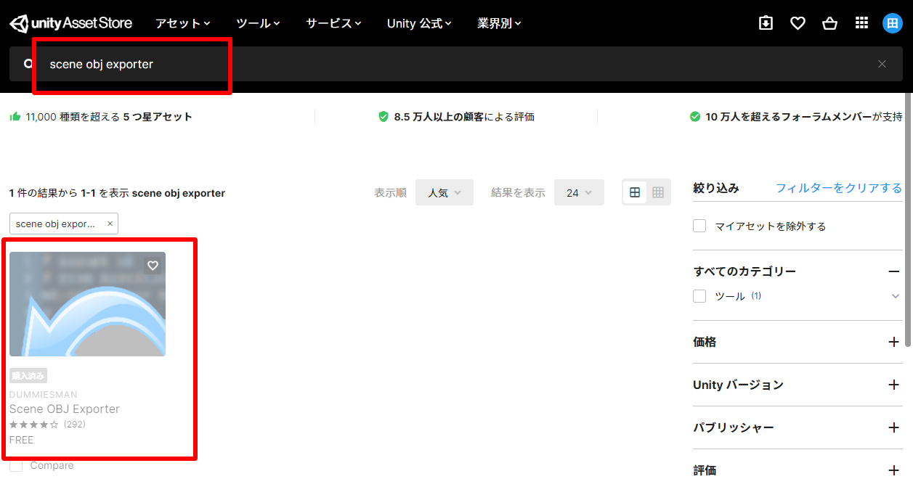
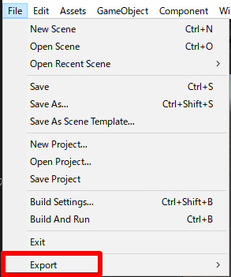
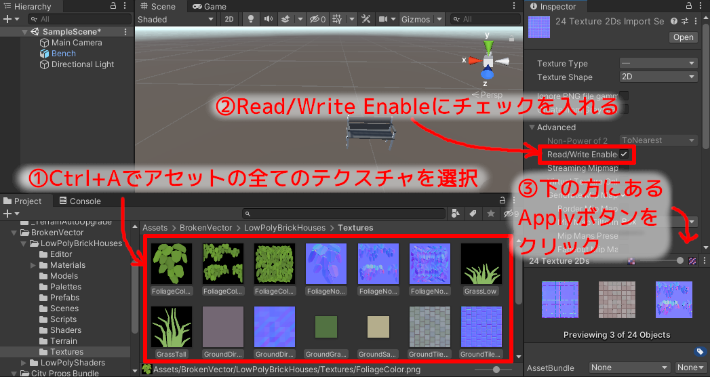
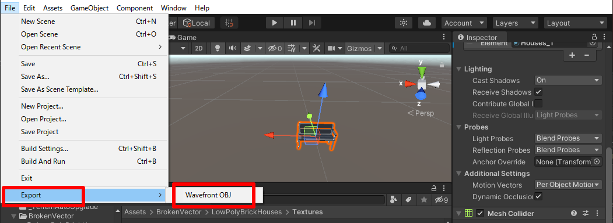
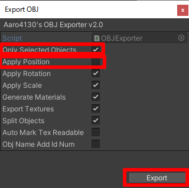
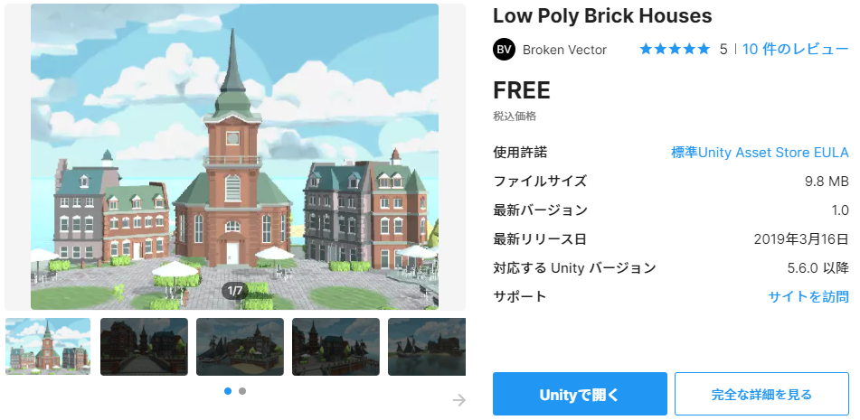
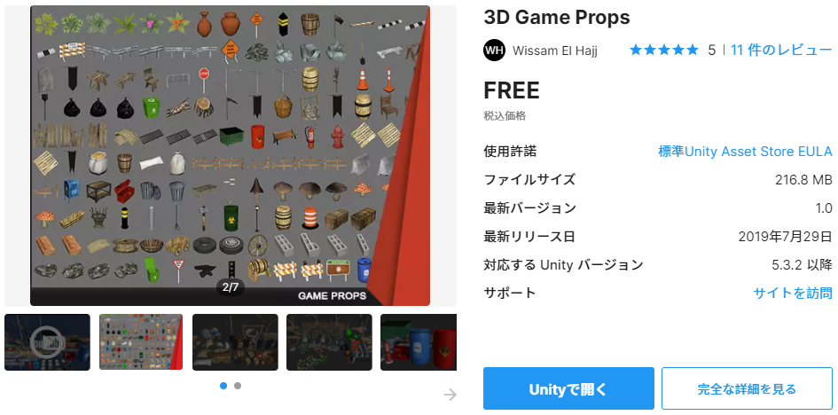
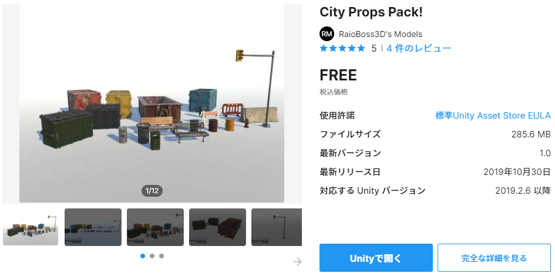

[OpenGL 3D 2021 Tips 第02回]

# Unityアセットから 　OBJファイルを出力する

## 1. Unityのアセットを使おう

### 1.1 Unityアセットストアのライセンスについて

Unityアセットストアにあるアセットには、Unity以外のアプリケーションでも利用可能とされているものがあります。例えば、標準的なUnityAssetStoreライセンスのものは利用可能です。

フリー、有料を問わず多くのアセットがこのライセンスになっているので、かなり選択の幅が広がると思います。

そこで、これらのアセットからOBJファイルを出力してOpenGLゲームで利用しよう、というのが本テキストの目的です。

### 1.2 Scene OBJ Exporterアセット

Unityには標準でOBJファイルを出力する機能がありません。ですから、まずはOBJファイルを出力する方法を追加する必要があります。

OBJ出力機能を追加するにはいくつかの方法がありますが、今回はアセットストアにある「Scene OBJ Exporter(シーン・オブジェ・エクスポーター)」を使おうと思います。

「Unity Asset Store」のサイトを開き、上部の検索ボックスに「scene obj exporter」と入力すると、次のようにアセットがひとつ見つかります。

このアセットをクリックすると、Scene OBJ Exporterアセットのページが開きます。

ページが開いたら、「マイアセットに追加する」をクリックしてアセットを追加してください。

次に、新しいプロジェクトを作成してUnityエディタを起動します。そして、メニューから「Edit -> Package Manager」を選択してパッケージマネージャを起動してください。

「Packages」の部分をクリックして「My Assets」を選択すると、リストに「Scene OBJ Exporter」が表示されると思います。「Scene OBJ Exporter」をクリックするとアセットの詳細が表示されるので、右下の「download」ボタンをクリックしてアセットをダウンロードしてください。

ダウンロードが終わるとボタンが「Import」に変化します。「Import」ボタンを押すと「Import Unity Package」ウィンドウが開きます。

右下の「Import」ボタンを押してしばらく待つと、プロジェクトに「Scene OBJ Exporter」がインポート(追加)されます。インポートが完了したら、「File」メニューをクリックしてください。メニューの一番下に「Export」という項目が追加されていたら、「Scene OBJ Exporter」のインポートは成功です。

表示されない場合は、新規プロジェクトの作成からやりなおしてみてください。

Export項目が表示されていたら、OBJファイルにしたいアセットをプロジェクトにインポートしてください。

### 1.3 OBJファイルと一緒にテクスチャを出力する

Scene OBJ ExporterでOBJファイルを出力する時、アセットによってはテクスチャが出力されないことがあります。最初に以下の設定を行うことで、テクスチャも出力されるようになります。

>1. アセットに含まれる全てのテクスチャを選択。
>2. インスペクタの「Read/Write Enable」項目にチェックを入れる。
>3. インスペクタの一番下の「Apply」ボタンをクリックして変更を反映。

アセットによってはテクスチャフォルダがなかったり、テクスチャが複数のフォルダに分散していることもあるので注意してください。 必要なテクスチャは、アセットのサンプルデータを参照して調べるとよいでしょう。

### 1.4 メッシュをOBJファイルとして出力する

適当なアセットをインポートしたら、アセットに付属しているサンプルシーンを開くか、新しいシーンを作成してOBJにしたいメッシュを配置します。

シーン内にある、OBJファイルにしたいメッシュを選択状態にして、メニューの「File -> Export -> Wavefront OBJ」をクリックします。

すると「Export OBJ」ウィンドウが開きます。以下のようにチェックボックスを設定してください。

>1. Only Selected Objectsにチェックを入れる(チェックを入れないとシーン全体が出力される)。
>2. Apply Positionのチェックを外す(チェックを入れるとシーンに配置した座標で出力される)。
>3. Exportボタンをクリック。

Exportボタンをクリックすると、出力ファイル名を指定するウィンドウが開きます。好きな名前と場所を選択して出力してください。

なお、OBJファイルと一緒に、マテリアル情報が書かれたMTLファイルが出力されます。OpenGLのテキストではMTLファイルには対応していないので、MTLファイルは削除してください。さらに、ノーマルマップにも対応していないので、ノーマルマップ画像ファイルも削除して構いません。

あとは、OBJファイルとテクスチャをResフォルダに移動し、OpenGLのプロジェクトから読み込んで使うだけです。

この手順を使えば、UnityのアセットをOBJファイルとして使えるようになります。

注意点として、`Skinned Mesh Renderer`には対応していません。ゲームオブジェクトに `Mesh Renderer`コンポーネントが設定されている必要があります。

つまり、このアセットだけでは、スケルタル・アニメーションをOBJ出力することはできません。

### 1.5 スケルタル・アニメーションをOBJファイルにする

スケルタル・アニメーション付きのモデルからOBJファイルを作るには、モデルを`Mesh Renderer`モデルに変換する必要があります。

以下のURLの最後にあるC#スクリプトをUnityプロジェクトに追加すると、`Skinned Mesh Renderer`の「︙」メニューに「Save Mesh As New Instance」という項目が追加されます。

> https://forum.unity.com/threads/exporting-skinned-mesh-to-obj-with-blendshapes-applyed-skinnedmeshrenderer-bakemesh.219033/

このスクリプトとScene OBJ Exporterを使ってOBJファイルを出力する手順は次のようになります。

>1. OBJ出力したいモデルをシーンに配置。
>2. OBJ出力したいアニメーションを、アニメーションコントローラーに設定。
>3. ポーズ状態でシーンを実行。
>4. ステップ実行で出力したいフレームまで進める。
>5. OBJ出力したいモデルを選択し「Save Mesh As New Instance」を選択。
>6. `Mesh Renderer`に変換したデータの出力先を聞かれるので、適当な場所に適当な名前をつけて保存。
>7. 必要なモーションを全て出力するまで4～6を繰り返す。
>8. 6で保存したファイルをUnityプロジェクトに追加し、シーンに配置。
>9. 配置したモデルを選択し、Fileメニューから「Export OBJ」を選択。

### 1.6 ポリゴン数が少なめのアセット

シーンにさまざまなモデルを配置すると、シーンの情報量が増えてリアリティが増します。アセットストアで良さそうなアセットを探してください。

どんなアセットを使えばいいか分からないときは、とりあえず以下のアセットを自分のゲームに組み込むことから始めてください。

>**Low Poly Brick Houses** 
>レンガづくりの町並みを作るアセットです。非常にデータが軽いので、まずはこのアセットを試してみるとよいでしょう。

>**3D Game Props** 
>中世と現代の街にありそうな、さまざまな小物をつめこんだアセットです。これひとつで基本的な小物は揃います。

>**City Props Pack!** 
>現代の街で見かける小物をつめこんだアセットです。3D Game Propsではバリエーションが足りない場合に追加するとよいでしょう。

