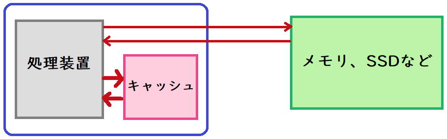
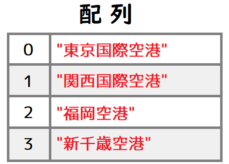
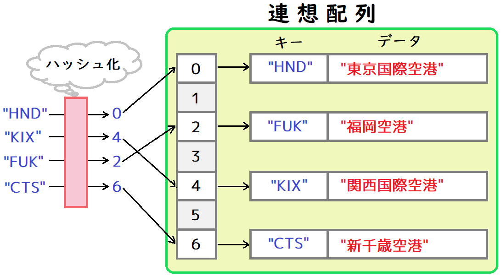

[OpenGL 3D 2021 Tips 第03回]

# テクスチャ・キャッシュ

## 1. キャッシュと連想配列

### 1.1 キャッシュとは何者か？

<p align="center">
<br>
</p>

キャッシュ(`cache`)は「食料や道具を隠しておく場所」という意味です。コンピューターにおいては、これに加えて「データを高速に読み書きするために保存する場所や機能」を表します。

現代のコンピューターは大量のデータを扱わなくてはなりません。しかし、データを保存するHDDやSSDは、CPUと比較すると非常に低速です。そのため、HDDやSSDは、最近使われたデータや今後使われる可能性が高いデータをキャッシュする仕組みを備えています。

また、CPUと比較するとメモリも相当に低速です。そのため、現代のコンピューターでは、キャッシュメモリという高速メモリを搭載して、データをキャッシュしています。

このように、コンピューターシステムはさまざまな場面でキャッシュを利用しています。キャッシュのおかげで高速に処理を行えるようになっているのです。

### 1.2 同じテクスチャを重複して読み込まない

本テキストのプログラムでは、テクスチャは毎回新しく作成しています。例えばゾンビが100体登場するとします。全てのゾンビが同じ画像をテクスチャに使うとしても、テクスチャはゾンビ1体ごとに作成されるわけです。

同じテクスチャが100枚もあるのはメモリがもったいないですし、テクスチャを切り替えることによって描画速度も低下してしまいます。この問題を解決するには、同じ画像ファイルからはひとつだけテクスチャが作られるようにしなくてはなりません。

そこで、画像ファイル名とテクスチャを関連付けて「隠された領域」、つまりキャッシュに記録しておきます。そして、テクスチャを作成するときは、まずキャッシュに同じ画像ファイル名から作られたテクスチャがないか検索します。

もしキャッシュの中にテクスチャがあればそのテクスチャを使いまわし、なければ新しくテクスチャを作ります。

このように、キャッシュを利用することで、同じ画像ファイルを読み込むことを回避するわけです。これは「テクスチャをキャッシュする」機能なので、「テクスチャ・キャッシュ」と呼ぶことにします。

### 1.3 連想配列

さて、テクスチャ・キャッシュを実現するには、画像ファイル名とテクスチャを関連付けて記録できなければなりません。このようなとき、プログラムで使われるデータ構造のひとつに「連想配列」と呼ばれるものがあります。

通常の配列は、次のように添え字とデータが直接結びついています。

<p align="center">
<br>
</p>

これに対して、連想配列は添え字の代わりに「キー」を使ってデータを管理します。キーとなる値(一般的には文字列)を「ハッシュ化」という操作で添え字に変換し、添え字の位置にデータを記録します。

<p align="center">
<br>
</p>

ハッシュ化によって得られる添え字はキーによって全く異なります。そのため、データが配列内のどこに記録されるかは分かりません。

ただし、同じキーからは同じ添え字が得られることは保証されています。そのおかげで、キーを使ってデータを検索することができるわけです。

一般的な「連想配列」の特徴を以下に示します。

>1. 「キー」と呼ばれる値とデータをペアにして記録する。
>2. キーが重複するデータを記録することはできない。例えば、キーAとデータXのペアを記録した後、キーAとデータYのペアを記録することはできない。
>3. データを参照するとき、通常の配列は数値を使うが、連想配列ではキーを使う。
>4. データを追加するとき、通常の配列では先頭から追加するが、連想配列ではどこに追加されるか分からない。

連続していない数値や文字列を使ってデータを記録・検索したい場合、連想配列は非常によいツールになりえます。

>**【ハッシュ化を行わない連想配列もある】**<br>
>ハッシュ化は多くの連想配列で使われていますが、連想配列に必須の機能というわけではありません。実際にC++には、`map`クラスというハッシュ化を行わない連想配列も用意されています。`map`クラスではハッシュ化の代わりに「赤黒木(あかくろぎ)」という方法でキーを管理します。

<div style="page-break-after: always"></div>

## 2. テクスチャ・キャッシュを作る

### 2.1 <ruby>unordered_map<rt>アンオーダード・マップ</rt></ruby>

C++言語において、連想配列は`unordered_map`(アンオーダード・マップ)というクラスで実装されています。

連想配列を使ったテクスチャ・キャッシュは以下のように作成します。まず`unordered_map`ヘッダをインクルードします。`Texture.cpp`に次のプログラムを追加してください。

```diff
 #include "Texture.h"
 #include "GLContext.h"
+#include <unordered_map>
 #include <iostream>

 /**
 * テクスチャ関連の機能を格納する名前空間.
```

次に、`unordered_map`クラスを使ってテクスチャ・キャッシュ変数を作成します。`samplerBindingState`配列の下に、次のプログラムを追加してください。

```diff
 * テクスチャイメージユニットにバインドされたサンプラIDを保持する.
 */
 GLuint samplerBindingState[16] = {};
+
+/**
+* ファイル名をキーとする連想配列.
+*/
+std::unordered_map<std::string, std::shared_ptr<Image2D>> textureCache;

 /**
 * コンストラクタ.
```

`unrodered_map`型を使うときは、2つのテンプレートパラメータを指定します。今回はファイル名を表す`std::string`と、Image2Dクラスのポインタを表す`std::shared_ptr<Image2D>`を指定しました。

第1パラメータの`std::stting`がキー、第2パラメータの`std::shared_ptr<Image2D>`がデータです。

### 2.2 テクスチャ・キャッシュを使う関数を宣言する

テクスチャ・キャッシュを使う場合、以下のプログラムを追加しなくてはなりません。

>1. 画像ファイルを読み込むタイミングで明示的にキャッシュの有無を調べる。
>2. キャッシュに登録されていたら、登録されているテクスチャを使う。
>3. キャッシュに登録されていなかったら、新しいテクスチャを作成してキャッシュに登録する。

この処理を、画像を読み込んでいる全ての場所に追加しなくてはなりません。このような場合、1～3の処理を自動で行う新しいテクスチャ作成関数を作り、画像読み込みをしている部分すべてを作成した関数で置き換えるのが簡単です。

ということで、上記の1～3を自動的に行うテクスチャ作成関数を作成していきます。まず`Texture.h`に関数宣言を追加するのですが、その前に次のインクルード文を追加してください。

```diff
 #define TEXTURE_H_INCLUDED
 #include <glad/glad.h>
 #include <string>
+#include <memory>

 namespace Texture {
```

次に2つの関数を宣言します。ひとつは「テクスチャ・キャッシュを考慮してテクスチャを作成する関数」で、名前は`CreateImage2D`(クリエイト・イメージ・ツーディ)とします。

もうひとつは「テクスチャ・キャッシュを空にする関数」で、名前は`ClearTextureCache`(クリア・テクスチャ・キャッシュ)です。それでは、`Image2D`クラス定義の下に、次のプログラムを追加してください。

```diff
   GLsizei width = 0;
   GLsizei height = 0;
 };
+
+// テクスチャ・キャッシュを考慮してテクスチャを作成する.
+std::shared_ptr<Image2D> CreateImage2D(const char*);
+
+// テクスチャ・キャッシュを空にする.
+void ClearTextureCache();

 void UnbindTexture(GLuint unit);
 void UnbindAllTextures();
```

### 2.3 CreateImage2D関数を定義する

`CreateImage2D`関数から定義をしていきましょう。`Texture.cpp`を開き、`Image2D::Height`関数の定義の下に次のプログラムを追加してください。

```diff
 {
   return height;
 }
+
+/**
+* テクスチャ・キャッシュを考慮して2Dテクスチャを作成する.
+*
+* @param filename 2Dテクスチャとして読み込むファイル名.
+* 
+* @return キャッシュから取得、または新規に作成したテクスチャ.
+*/
+std::shared_ptr<Image2D> CreateImage2D(const char* filename)
+{
+  // キャッシュを検索し、同名のテクスチャが見つけたら、見つけたテクスチャを返す.
+  auto itr = textureCache.find(filename);
+  if (itr != textureCache.end()) {
+    return itr->second;
+  }
+
+  // キャッシュに同名のテクスチャがなかったので、新しくテクスチャを作る.
+  // 新しく作成したテクスチャをテクスチャキャッシュに追加する.
+  std::shared_ptr<Image2D> p = std::make_shared<Image2D>(filename);
+  textureCache.emplace(filename, p);
+
+  // 新しく作成したテクスチャを返す.
+  return p;
+}

 /**
 * 全てのテクスチャのバインドを解除する.
```

`unordered_map`から、ファイル名と一致するデータ取得するには`find`(ファインド)メンバ関数を使います。一致するデータが見つかった場合、そのデータの位置を返します。見つからなかった場合、`end`メンバ関数が返すのと同じ値を返します。

つまり、`find`の戻り値と`end`の戻り値を比較すれば、一致するデータが見つかったかどうかが分かる、というわけです。

また、`unordered_map`はキーとデータをペアにして記録しているので、`find`の戻り値からはどちらの値でも取得できます。キーは`first`(ファースト)メンバ変数、データは`second` (セカンド)メンバ変数で参照できます。

上記のプログラムでは`return itr->second;`とすることで、データである `std::shared_ptr<Image2D>`型の値を返しています。

キャッシュに一致するデータが見つからない場合、新しいテクスチャを作成してキャッシュに登録します。作成自体はこれまでどおり`std::make_shared`関数で行います。

「キャッシュに登録する」というのは「`unordered_map`に新しいキーとデータのペアを追加する」ということです。これを行うには`emplace`(エンプレイス)メンバ関数を使います。

`emplace`の第1引数にキー、第2引数にデータを指定して呼び出すとペアとして追加されます。

### 2.4 ClearTextureCache関数を定義する

続いて、テクスチャ・キャッシュを空にする関数を定義します。`CreateImage2D`関数の定義の下に、次のプログラムを追加してください。

```diff
   // 新しく作成したテクスチャを返す.
   return p;
 }
+
+/**
+* テクスチャ・キャッシュを空にする.
+*/
+void ClearTextureCache()
+{
+  textureCache.clear();
+}

 /**
 * 全てのテクスチャのバインドを解除する.
```

`clear`(クリア)メンバ関数は、`unordered_map`に追加されたすべてのキーとデータを消去します。キャッシュのクリアはこれだけです。

<div style="page-break-after: always"></div>

### 2.5 テクスチャ・キャッシュを使う

テクスチャ・キャッシュyを使うようにプログラムを変更するには、以下の手順を行います。

>1. `Texture.cpp`以外の場所にある、全ての`std::make_shared<Texture::Image2D>`関数呼び出しを`Texture::CreateImage2D`関数に置き換える。
>2. ステージやマップを切り替えるタイミングで`Texture::ClearTextureCache`関数を呼び出す。

ただし、`2`で行っているテクスチャ・キャッシュのクリアは必須ではありません。現在のパソコンのハードウェアを考慮すると、ゲーム中で使用するテクスチャの合計が1ギガバイトを超えない程度なら、キャッシュを空にする必要はありません。

例えば、32ビットで大きさが1024x1024のTGAファイルの場合、1枚のテクスチャに必要なメモリは4メガバイトになります。32ビット1024x1024画像を250枚使うと1ギガバイトになります。32ビット512x512画像なら1000枚で1ギガバイトです。

ちなみに、ゾンビは32ビット256x256画像を使っています。これは1枚が0.25メガバイトなので、4000枚読み込むことができる計算です。

ところで、テクスチャ・キャッシュを使わない場合(つまり現在のプログラムの場合)、すでに読み込んだ画像と同じファイルであっても、`std::make_shared<Image2D>`が実行されるたびにテクスチャが作成されます。

そのため、ゾンビを100体表示すると、`0.25 * 100`でグラフィックスメモリを25メガバイト使います。メタルネス・ラフネス画像も同じサイズなので、これも読み込んだとすると合計で50メガバイトです。

このように、現状でもグラフィックスメモリにはかなり余裕があります。テクスチャ・キャッシュを導入する意義は、メモリ効率よりも「テクスチャを切り替えないことによる描画速度の向上」が大きいといえるでしょう。

<pre class="tnmai_assignment">
<strong>【課題01】</strong>
<coee>Texture.cpp</code>以外の全ての<code>std::make_shared&lt;Texture::Image2d&gt;</code>を、<code>Texture::CreateImage2D</code>関数で置き換えなさい。
</pre>

<pre class="tnmai_assignment">
<strong>【課題02】</strong>
シーン切り替えやステージ切り替えを行うプログラムに、<code>Texture::ClearTextureCache</code>関数の呼び出しを追加しなさい。
</pre>

<div style="page-break-after: always"></div>

>**【市販のゲームにおけるテクスチャのサイズと枚数】**<br>
>PS4やPS5、XBOX ONE、XBOX Series Xなどが使う画像サイズは、より高精細な表現をするために4096x4096が当たり前になっています。32ビット画像だと1枚64メガバイトになりますが、大抵は「圧縮テクスチャ」を使っているため、実際は1枚8～16メガバイトになります。圧縮していても、我々のゾンビテクスチャと比べて、はるかに大量のメモリを使うわけです。なおNintendo Switchは性能もメモリも控えめなので、圧縮あり1024x1024程度が主流です。<br>
>テクスチャのサイズはメモリ消費量だけでなく、描画性能にも大きく影響します。そのため、単に大きくすればよいというものではありません。GPUの性能を引き出すには、見た目を損なわないように注意しつつ、用途に応じて可能な限り小さい画像を使うことが求められます。<br>
>市販ゲームでは、ひとつのシーンに数百枚のテクスチャを使うことも多いので、テクスチャの管理は重要な問題のひとつです。
