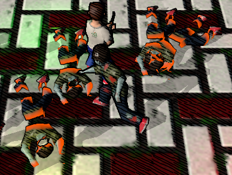
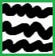
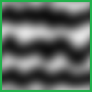

[OpenGL 3D 2021 Tips 第04回]

# テクスチャ・アニメーション

## 1. タイマーを使ったアニメーション

### 1.1 死亡エフェクトテクスチャ

倒した敵が画面に残っていると、その描画処理に時間を取られます。そのため、多くのゲームでは死んだ敵をシーンから削除します。しかし、単純に削除すると不自然なので、通常はアニメーションやエフェクトを使って違和感を減らします。

今回はシェーダーで格好いい死亡エフェクトを作成し、死んだ敵に適用してみます。エフェクトは次の画像のように「体のあちこちが燃えて消えていく」ものになります。

<p align="center">
<br>
</p>

早速ですが、プロジェクトの`Res`フォルダに`DeathEffect.tga`というTGAファイルを追加してください。次に、作成した`DeathEffect.tga`の画像サイズを64x64にします。サイズを変えたら、10ピクセルの太さのペンを使って、適当に以下のような数本の波線を引いてください。

<p align="center">
<br>
</p>

線を引いたら画像エディタの上部右端にある小さな`▼`ボタンをクリックし、「フィルター→ぼかし」を選択してください。すると、画像が少しだけボケます。1回ではボカしたりないので何度か繰り返してもうすこしボカすことにします。

`▼`ボタンの左にある「詳細」ボタンをクリックすると、選択した操作が再実行されます。「詳細」ボタンを9回ほどクリックして、画像をいい感じにボカしてください。

<p align="center">
<br>
</p>

作成してもらったこの画像は、エフェクトが燃え広がる方向を制御するためのテクスチャとして使います。黒い部分から燃え始め、徐々に白い部分へ燃え広がるようにします。

### 1.2 死亡エフェクトシェーダー

続いて、死亡エフェクトテクスチャを使うシェーダーを書きましょう。`Res`フォルダに `DeathEffect.frag`というファイルを追加します。追加したファイルを開き、 `FragmentLighting.frag`の内容をまるごとコピー&貼り付けしてください。

それでは、死亡エフェクトのプログラムを追加しましょう。まず死亡エフェクトテクスチャ用のサンプラを定義します。`DeathEffect.frag`のユニフォーム変数定義に、次のプログラムを追加してください。

```diff
 // ユニフォーム変数
 layout(binding=0) uniform sampler2D texColor;
 layout(binding=1) uniform sampler2D texMetallicSmoothness;
+layout(binding=2) uniform sampler2D texDeathEffect;

 // 平行光源
 struct DirectionalLight {
```

それから、エフェクトをアニメーションさせるためのユニフォーム変数を追加します。視点座標のユニフォーム変数の下に、次のプログラムを追加してください。

```diff
 // 視点座標
 layout(location=7) uniform vec3 viewPosition;
+
+// 死亡エフェクトタイマー
+layout(location=8) uniform float effectTimer;

 // 円周率.
 const float PI = 3.14159265359;
```

`timer`ユニフォーム変数には、死亡エフェクトが始まってからの経過秒数を入力されることを想定しています。

これで変数の追加は完了です。それでは、追加した変数を使ってエフェクトを作成しましょう。`main`関数の末尾に次のプログラムを追加してください。

```diff
   fragColor.rgb = (diffuse * totalLightColor) + (specular * totalSpecularColor) +
   (ambientLight * fragColor.rgb * metallic);
+
+  // 死亡エフェクト.
+  float effectValue = texture(texDeathEffect, inTexcoord).r;
+  if (effectValue <= effectTimer) {
+    discard;
+  }
 }
```

上記のプログラムは、

>死亡エフェクトテクスチャの値`effectValue`が`effectTimer`以下なら、フラグメントの描画をキャンセルする

という内容です。描画をキャンセルするには`discard`(ディスカード)キーワードを使います。

### 1.3 エフェクト用タイマー設定関数を追加する

追加したユニフォーム変数に値を設定する関数を追加します。`Shader.h`を開き、次のプログラムを追加してください。

```diff
   bool SetMorphWeight(const glm::vec3& weight) const;
   bool SetViewPosition(const glm::vec3& position) const;
+  bool SetEffectTimer(float) const;

 private:
   GLuint id = 0;
```

次に`Shader.cpp`を開き、`Pipeline::SetViewPosition`メンバ関数定義の下に、次のプログラムを追加してください。

```diff
   return true;
 }
+
+/**
+* シェーダにエフェクト用タイマーの値を設定する.
+*
+* @param time 設定するタイマー値.
+*
+* @retval true  設定成功.
+* @retval false 設定失敗.
+*/
+bool Pipeline::SetEffectTimer(float time) const
+{
+  glGetError(); // エラー状態をリセット.
+
+  const GLint locTime = 8;
+  glProgramUniform1f(fp, locTime, time);
+  if (glGetError() != GL_NO_ERROR) {
+    std::cerr << "[エラー]" << __func__ << ":エフェクト用タイマーの設定に失敗.\n";
+    return false;
+  }
+  return true;
+}
```

これでエフェクト用タイマーに値を設定できるようになりました。

### 1.4 死亡エフェクト用シェーダーを読み込む

`DeathEffect`シェーダーを読み込みましょう。`GameData.h`を開き、輪郭線シェーダー用のパイプライン変数定義の下に、次のプログラムを追加してください。

```diff
   std::shared_ptr<Shader::Pipeline> pipelineHatching;
   std::shared_ptr<Shader::Pipeline> pipelineOutline;
+  std::shared_ptr<Shader::Pipeline> pipelineDeathEffect;

   Mesh::PrimitiveBuffer primitiveBuffer;
   Texture::Sampler sampler;
```

`GameData.cpp`を開き、輪郭線シェーダーを読み込むプログラムの下に、次のプログラムを追加してください。

```diff
   if (!pipelineOutline || !*pipelineOutline) {
     return false;
   }
+  pipelineDeathEffect = std::make_shared<Shader::Pipeline>(
+   "Res/FragmentLighting.vert", "Res/DeathEffect.frag");
+  if (!pipelineDeathEffect|| !*pipelineDeathEffect) {
+    return false;
+  }
 
   // サンプラ・オブジェクトを作成する.
   sampler.SetWrapMode(GL_REPEAT);
```

### 1.5 3Dモデルの質感を表すクラスを作る

3Dモデルの質感は、テクスチャとシェーダーによって作られます。シェーダーを使ったエフェクトも質感のひとつだと考えられます。本節では、質感の管理を容易にするため、テクスチャとシェーダーを合わせて`Material`(マテリアル)というクラスにまとめます。

マテリアルクラスはアクタークラスから利用され、描画パラメータの設定、マテリアルの状態更新を担当することになります。派生クラスで機能を追加できるように、これらの機能を仮想関数として定義することにします。

プロジェクトの`Src`フォルダに`Material.h`というヘッダファイルを追加してください。追加したファイルを開き、次のプログラムを追加してください。

```diff
+/**
+* @file Material.h
+*/
+#ifndef MATERIAL_H_INCLUDED
+#define MATERIAL_H_INCLUDED
+#include "Shader.h"
+#include "Texture.h"
+#include <memory>
+
+/**
+* アクターの質感.
+*/
+class Material
+{
+public:
+  explicit Material(std::shared_ptr<Shader::Pipeline> p) : pipeline(p) {}
+  virtual ~Material() = default;
+
+  virtual void Update(float deltaTime) {}
+  virtual void OnDraw() {}
+
+  std::shared_ptr<Shader::Pipeline> pipeline;
+};
+
+#endif // MATERIAL_H_INCLUDED
```

次に`Actor`クラスにマテリアルを使った描画機能を追加します。`Actor.h`を開き、 `Material.h`をインクルードしてください。

```diff
 #include "Mesh.h"
 #include "Shader.h"
+#include "Material.h"
 #include <glm/glm.hpp>
 #include <memory>
```

次に`Actor`クラスの定義にマテリアルを追加してください。

```diff
   float morphTransitionTimer = 0;
   std::shared_ptr<Texture::Image2D> texture;
   std::shared_ptr<Texture::Image2D> texMetallicSmoothness;
+  std::shared_ptr<Materail> material;

   glm::vec3 position = glm::vec3(0); // アクターの表示位置.
   glm::vec3 rotation = glm::vec3(0); // アクターの向き.
```

さらに、マテリアルを使うバージョンの描画関数を追加します。`Draw`メンバ関数の宣言の下に、次のプログラムを追加してください。

```diff
     shadow, // 影描画.
   };
   void Draw(const Shader::Pipeline& pipeline, const glm::mat4& matVP, DrawType) const;
+  void Draw(const glm::mat4&, DrawType) const;

   void SetCylinderCollision(float top, float bottom, float radius);
   void SetBoxCollision(const glm::vec3& min, const glm::vec3& max);
```

これで`Actor`クラスの宣言の修正は完了したので、次は定義を修正します。`Actor.cpp`を開き、`Actor`コンストラクタにデフォルトのマテリアルを設定するプログラムを追加してください。

```diff
 Actor::Actor(std::string name, const Mesh::Primitive* prim,
   std::shared_ptr<Texture::Image2D> tex, const glm::vec3& pos) :
-  name(name), primitive(prim), texture(tex), position(pos)
+  name(name), primitive(prim), texture(tex),
+  material(std::make_shared<Material>(GameData::Get().pipeline)),
+  position(pos)
 {
 }
```

次に、マテリアルの更新処理を呼び出します。`Actor::Update`メンバ関数の末尾に、に次のプログラムを追加してください。

```diff
     morphTarget = animation->list[nextAnimationNo];
   }
+
+  // マテリアル更新.
+  if (material) {
+    material->Update(deltaTime);
+  }
 }

 /**
 * アクターを描画する.
```

最後に、マテリアルの描画前処理を呼び出します。`Actor::Draw`メンバ関数の定義の下に、次のプログラムを追加してください。

```diff
   // プリミティブを描画.
   primitive->Draw(morphTarget, prevBaseMesh, prevMorphTarget);
 }
+
+/**
+* マテリアルを使ってアクターを描画する.
+*
+* @param matVP    描画に使用するビュープロジェクション行列.
+* @param drawType 描画の種類.
+*/
+void Actor::Draw(const glm::mat4& matVP, DrawType drawType) const
+{
+  if (material && material->pipeline) {
+    material->OnDraw();
+    material->pipeline->Bind();
+    Draw(*material->pipeline, matVP, drawType);
+  }
+}

 /**
 * 垂直円柱の衝突判定を設定する.
```

それでは、アクターの描画この関数を使うように変更しましょう。`MainGameScene.cpp` の `MainGameScene::Render`メンバ関数を次のように変更してください。

```diff
   // アクターリストを描画.
   pipeline->SetViewPosition(playerActor->position + glm::vec3(0, 7, 7));
+
+  std::shared_ptr<Shader::Pipeline> pipelineDeathEffect = global.pipelineDeathEffect;
+  pipelineDeathEffect->SetAmbientLight(glm::vec3(0.1f, 0.125f, 0.15f));
+  pipelineDeathEffect->SetLight(directionalLight);
+  pipelineDeathEffect->SetViewPosition(playerActor->position + glm::vec3(0, 7, 7));
+
   const glm::mat4 matVP = matProj * matView;
   for (size_t i = 0; i < actors.size(); ++i) {
-    actors[i]->Draw(*pipeline, matVP, Actor::DrawType::color);
+    actors[i]->Draw(matVP, Actor::DrawType::color);
   }
```

なお、`SetAmbientLight`及び`SetViewPosition`メンバ関数の引数は、デフォルトの `pipline`変数に指定したのと同じ値にする必要があります。上記のプログラムで設定している値は「単なる例」なので、みなさんのプログラムで設定している値に変更してください。

なお、今回は影の描画については変更しません。現在のところ、影に使うシェーダーは決まっているからです。

これでマテリアルを使って描画することができるようになりました。

### 1.6 死亡エフェクトマテリアルを作る

`Material`クラスの派生クラスとして、死亡エフェクトシェーダーを使うマテリアルを作成しましょう。プロジェクトの`Src`フォルダに`DeathEffectMaterial.h`という名前のヘッダファイルを追加してください。追加したファイルを開き、次のプログラムを追加してください。

```diff
+/**
+* @file DeathEffectMaterial.h
+*/
+#ifndef DEATHEFFECTMATERIAL_H_INCLUDED
+#define DEATHEFFECTMATERIAL_H_INCLUDED
+#include "Material.h"
+
+/**
+* 死亡エフェクト.
+*/
+class DeathEffectMaterial : public Material
+{
+public:
+  DeathEffectMaterial();
+  virtual ~DeathEffectMaterial() = default;
+
+  virtual void Update(float deltaTime) override;
+  virtual void OnDraw() override;
+  bool IsFinished() const;
+
+private:
+  std::shared_ptr<Texture::Image2D> texture;
+  float timer = 0;
+  float speed = 0.5f; // エフェクトの進行速度.
+};
+
+#endif // DEATHEFFECTMATERIAL_H_INCLUDED
```

続いて定義を作成します。プロジェクトの`Src`フォルダに`DeathEffectMaterial.cpp`というファイルを追加し、次のプログラムを追加してください。

```diff
+/**
+* @file DeathEffectMaterial.cpp
+*/
+#include "DeathEffectMaterial.h"
+#include "GameData.h"
+
+/**
+* コンストラクタ. 
+*/
+DeathEffectMaterial::DeathEffectMaterial() :
+  Material(GameData::Get().pipelineDeathEffect),
+  texture(Texture::CreateImage2D("Res/DeathEffect.tga"))
+{
+}
+
+/**
+* 死亡エフェクトの更新.
+*
+* @param deltaTime 前回の更新からの経過時間(秒).
+*/
+void DeathEffectMaterial::Update(float deltaTime)
+{
+  timer += deltaTime * speed;
+}
+
+/**
+* 描画前処理. 
+*/
+void DeathEffectMaterial::OnDraw()
+{
+  pipeline->SetEffectTimer(timer);
+  texture->Bind(2);
+}
+
+/**
+* エフェクトが終了したか調べる.
+*
+* @retval true  終了している.
+* @retval false まだ実行中.
+*/
+bool DeathEffectMaterial::IsFinished() const
+{
+  return timer >= 1.0f;
+}
```

`IsFinished`(イズ・フィニッシュド)メンバ関数を追加したのは、マテリアルを使用するクラスが、死亡エフェクトの終了を検出できるようにするためです。

### 1.7 ゾンビが死んだらマテリアルを変える

ゾンビが死亡したとき、作成した死亡エフェクトマテリアルに切り替わるようにします。 `ZombieActor.cpp`を開き、`DeathEffectMaterial.h`ヘッダファイルをインクルードしてください。

```diff
 * @file ZombieActor.cpp
 */
 #include "ZombieActor.h"
+#include "DeathEffectMaterial.h"
 #include "MainGameScene.h"
 #include "GameData.h"
```

次に死亡時にマテリアルを変更します。コンストラクタで`OnHit`変数に指定しているラムダ式の末尾に、次のプログラムを追加してください。

```diff
         zombie.pMainGameScene->AddBloodSprite(zombie.position);
       }
       Audio::Instance().Play(3, CRI_SE_GUTTING_1);
     }
+
+    // 今回の衝突で死亡したなら死亡エフェクトマテリアルに切り替える.
+    if (a.state == State::dead) {
+      a.material = std::make_shared<DeathEffectMaterial>();
+    }
   };
 
   // アニメーションを設定.
   SetAnimation(GameData::Get().anmZombieMaleWalk);
```

そして、エフェクトが終了したらアクターを消去します。`ZombieActor::OnUpdate`メンバ関数の末尾に、次のプログラムを追加してください。

```diff
   } else if (state != State::dead) {
     velocity.x = velocity.z = 0;
+  } else if (state == State::dead) {
+    // 死亡エフェクトが終了していたらアクターを削除する.
+    DeathEffectMaterial& m = static_cast<DeathEffectMaterial&>(*material);
+    if (m.IsFinish()) {
+      isDead = true;
+    }
+  }
 }
```

プログラムが書けたらビルドして実行してください。ゾンビが死んだとき、身体が虫食い状に透明になって消えたら成功です。

### 1.8 エフェクトを調整する

透明になるだけだとインパクトに欠けますね。シェーダーを改良してインパクトを強化しましょう。`DeathEffect.frag`を開き、死亡エフェクトのプログラムを次のように変更してください。

```diff
   // 死亡エフェクト.
+  const float effectEdge = 0.2; // 消失部位の輪郭の太さ.
+  const vec3 effectColor = vec3(2.0, 0.05, 0.01); // 消失部位の輪郭の色.
   float effectValue = texture(texDeathEffect, inTexcoord).r;
-  if (effectValue <= effectTimer) {
+  effectValue -= effectTimer;
+  if (effectValue <= 0.0) {
     discard;
+  } else if (effectValue <= effectEdge) {
+    // 消失部位の周囲に色を付ける.
+    float ratio = effectValue * (1.0 / effectEdge);
+    fragColor.rgb = mix(effectColor, fragColor.rgb, ratio);
   }
 }
```

この変更によって、`effectValue`には死亡エフェクトテクスチャの値とエフェクトタイマーの差が格納されます。この値によって、以下のように挙動を変化させています。

>* 差が`0`以下なら描画をキャンセルする。
>* 差が`effectEdge`(エフェクトエッジ)以下なら赤色にする。

また、色を付けるときに`mix`関数を使うことで、単純に`effectEdge`以下を赤色にするのではなく、差が`0`に近くなるに従って徐々に赤くなるようにしています。

プログラムが書けたらビルドして実行してください。消失部位の周囲に赤いエッジが表示されたら成功です。

このようにテクスチャとタイマー変数を組み合わせることで、シェーダーで画像を動かしたり、特殊なエフェクトをかけることができます。

<pre class="tnmai_assignment">
<strong>【課題01】</strong>
<code>effectEdge</code>の数値を増減して、好みの輪郭の太さになるように調整しなさい。
</pre>

<pre class="tnmai_assignment">
<strong>【課題02】</strong>
<code>effectColor</code>の数値を変更して、好みの色が表示されるように調整しなさい。
</pre>

<pre class="tnmai_assignment">
<strong>【課題03】</strong>
好みのゾンビの消え方になるように<code>DeathEffect.tga</code>画像を変更しなさい。
GIMPやPhotoShopで作れる雲模様やノイズ画像がオススメです。
</pre>
