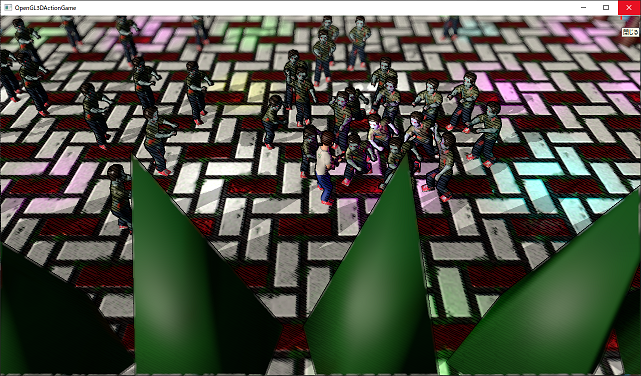
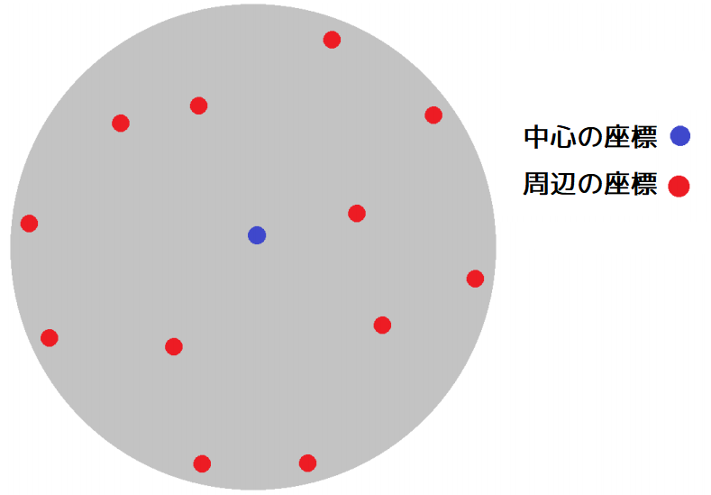
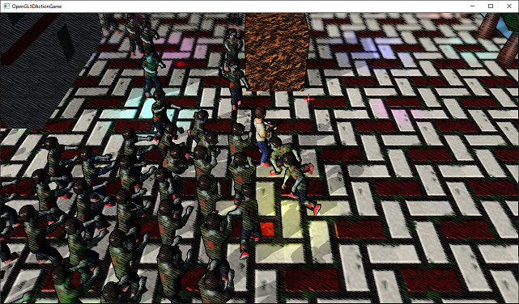

[OpenGL 3D 2021 Tips 第05回]

# カメラのボケを表現する

## 1. ピントの合っていない部分をぼかす

### 1.1 ボケ度合いを計算する

<p align="center">
<br>
</p>

映像や写真では、レンズの焦点が合っていない部分はボケて写ります。今回はシェーダーでこのボケを作り出します。これは以下の手順で行います。

>1. 深度バッファの奥行き値をメートル単位に変換する。
>2. 奥行き値からピンぼけ度合いを計算する。
>3. ピンぼけ度合いに応じて周辺のピクセルの色を読み取って合成する。

まず深度バッファの値をビュー座標系に変換します。この変換はなくても構わないのですが、ビュー座標系でないとボケ制御パラメータを決める時に分かりづらくなります。

まずピンぼけ処理に使うパラメータを定義します。`Filter_Pencil.frag`を開き、次のプログラムを追加してください。

```diff
 layout(binding=1) uniform sampler2D texPencil;
 layout(binding=2) uniform sampler2D texDepth;
+
+// カメラパラメータ(単位:メートル)
+const float cameraNear = 1.0;   // カメラのニア平面までの距離
+const float cameraFar = 500.0;  // カメラのファー平面までの距離
+
+// ピンぼけ制御パラメータ(単位:メートル)
+const float focusPoint = 10.0; // カメラから注視点までの距離
+const float bokehStart = 2.0;  // ボケ始める範囲
+const float bokehEnd   = 8.0;  // ボケが最大になる範囲
+const float bokehPower = 5.0;  // ボケの強さ

 // フラグメントシェーダプログラム
 void main()
```

ビュー座標系への変換には、`glm::perspective`関数に指定したニア平面とファー平面の値が必要です。もし実際に指定している値が上記テキストと違う場合は、実際に指定している値を使ってください。

ピンぼけ制御パラメータについてはコメントに書いてあるとおりです。上記の設定ではカメラから10mの地点の前後2mは全くボケません。そして、2mから8mまで徐々にボケが強くなっていきます。

次に、ボケ度合いを計算する関数を作成します。関数名は`CalculateBokehValue`(カルキュレート・ボケ・バリュー)とします。ピンぼけ制御パラメータの下に、次のプログラムを追加してください。

```diff
 const float bokehEnd   = 8.0;  // ボケが最大になる範囲
 const float bokehPower = 5.0;  // ボケの強さ
+
+/**
+* 奥行きからボケ度合いを計算.
+*/
+float CalculateBokehValue()
+{
+  float z = texture(texDepth, inTexcoord).r;
+
+ // NDC座標系へ変換.
+  z = 2.0 * z - 1.0;
+
+  // glm::perspective関数の逆の計算を行って、深度バッファの値を視点からのメートル距離に変換.
+  z = -(2 * cameraNear * cameraFar) / (cameraFar + cameraNear - z * (cameraFar - cameraNear));
+
+  // ボケ度合いを計算.
+  z = abs(z + focusPoint);
+  z = max(z - bokehStart, 0.0);
+  z = min(z / (bokehEnd - bokehStart), 1.0);
+  return z;
+}

 // フラグメントシェーダプログラム
 void main()
```

深度バッファの値はNDC座標系の値-1.0～1.0を0.0～1.0に圧縮したものです(この圧縮はGPUが自動的に行います)。そこで、値を展開してNDC座標系の値に戻します。

次に`glm::perspective`関数が行うのとは逆の処理を行い、ビュー座標系の値に戻します。透視投影変換の方法はひとつではありません。上記の逆変換は`glm::perspective`関数の実装から逆算したものになります。

ビュー座標系の値に変換したら、今度はピンぼけ制御パラメータを使って`0.0～bokehStart`が`0`、`bokehEnd`以上が`1`となるような変換を行います。これで、ボケ度合いを計算できるようになりました。

### 1.2 ボケ度合いに応じて画像をぼかす

次は実際に画像をぼかす関数を定義します。ぼかし処理は、ボケ度合いに比例した範囲の複数のピクセルを読み取り、それらの平均を計算することで行います。

読み取るピクセルの数を増やせば増やすほど、なめらかなボケ画像が得られます。しかし、読み取るピクセルが増えると、それだけシェーダーの実行に時間がかかります。

ですから、できるだけ読み取るピクセル数を減らしつつ、それでいてなめらかなボケ画像を作り出す必要があります。この相反する目的を達成するために、「ポアソン・ディスク・サンプリング」という方法を使うことにします。

<p align="center">
<br>
</p>

「ポアソン・ディスク・サンプリング」は、「他のすべての点から一定以上離れた均一な点の集まり」を作り出す方法です。ポアソン氏が考案した手法に基づいていることからこの名前が付いています。

詳しい説明は省きますが、ある範囲の平均色を求めるときにポアソン・ディスク・サンプリングを使うと、規則的な座標や単にランダムな座標を使うのと比べて、より少ない座標数で同くらいきれいな結果が得られるのです。

今回はこちらで用意した座標を使います。ピンぼけ制御パラメータの下に、次のプログラムを追加してください。

```diff
 const float bokehEnd   = 8.0;  // ボケが最大になる範囲
 const float bokehPower = 5.0;  // ボケの強さ
+
+// ポアソン・ディスク
+const int poissonSampleCount = 12;
+const vec2 poissonDisc[poissonSampleCount] = {
+  {-0.326,-0.406},
+  {-0.840,-0.074},
+  {-0.696, 0.457},
+  {-0.203, 0.621},
+  { 0.962,-0.195},
+  { 0.473,-0.480},
+  { 0.519, 0.767},
+  { 0.185,-0.893},
+  { 0.507, 0.064},
+  { 0.896, 0.412},
+  {-0.322,-0.933},
+  {-0.792,-0.598}
+};

 /**
 * 奥行きからボケ度合いを計算.
```

>**【ポアソンディスクの座標はどこから？】**<br>
>上記の値は<br>`https://www.diva-portal.org/smash/get/diva2:1384527/FULLTEXT01.pdf`<br>の12ページの表3.6を使いました。<br>
>座標の求め方にはさまざまなアルゴリズムが考案されていますが、例えば次のサイトのツールを使うことで作成することができます。<br>
>`https://github.com/bartwronski/PoissonSamplingGenerator`

次に、この配列を使って画像をぼかす関数を追加します。関数名は`GetBokehColor`(ゲット・ボケ・カラー)とします。`CalculateBokehValue`関数の定義の下に、次のプログラムを追加してください。

```diff
   z = min(z / (bokehEnd - bokehStart), 1.0);
   return z;
 }
+
+/**
+* ボケ度合いに応じてぼかしたピクセル色を取得する.
+*
+* @param texBokeh  ぼかしに使うテクスチャ.
+* @param bokeh     ボケ度合い(0.0～1.0).
+*
+* @return ぼかしたピクセルの色.
+*/
+vec4 GetBokehColor(sampler2D texBokeh, float bokeh)
+{
+  // 円形の範囲のピクセルを読み込む.
+  vec2 subPixelSize = vec2(1.0) / textureSize(texBokeh, 0);
+  vec4 bokehColor = texture(texBokeh, inTexcoord);
+  for (int i = 0; i < poissonSampleCount; ++i) {
+    vec2 offset = subPixelSize * poissonDisc[i] * bokeh * bokehPower;
+    bokehColor += texture(texBokeh, inTexcoord + offset);
+  }
+
+  // 平均値を求める.
+  bokehColor *= 1.0 / float(poissonSampleCount + 1);
+
+  return baseColor;
+}

 // フラグメントシェーダプログラム
 void main()
```

この関数の主要部分は、`for`文を使って円形の範囲のピクセルを読み取って合計し、読み取った回数で割って平均を計算しているところです。

### 1.3 ピンぼけを実装する

それでは作成した関数を使ってピンぼけを実装しましょう。フラグメントシェーダーの`main`関数を次のように変更してください。

```diff
 void main()
 {
   // カラーを取得.
+  float bokeh = CalculateBokehValue();
-  fragColor = inColor * texture(texColor, inTexcoord);
+  fragColor = inColor * GetBokehColor(texColor, bokeh);

   // 斜線テクスチャを等倍で画面全体に敷き詰める.
   vec2 screenSize = vec2(1280, 720); // 画面サイズ.
```

プログラムが書けたらビルドして実行してください。画面の上の方が少しボケていたら成功です。

<p align="center">
<br>
</p>

### 1.4 ボケている部分の鉛筆線を消す

輪郭線などが表示されていると、あまりボケているように見えないかもしれません。そこで、ボケている部分は鉛筆の線を消すようにします。車線と輪郭の色を乗算するプログラムを、次のように変更してください。

```diff
   outline *= texture(texDepth, inTexcoord).r; // 奥行きによる変化量の差をなくす.
   outline = 1 - smoothstep(0.0, 0.01, abs(outline)); // 輪郭線ではない部分を1にする.

   // 斜線と輪郭の色を元の色に乗算.
-  fragColor.rgb *= pencil * outline;
+  fragColor.rgb *= mix(pencil * outline, vec3(1.0), bokeh);
 }
```

`mix`関数を使って、`bokeh`が大きい(1.0に近い)ほど線が薄くなるようにしています。

プログラムが書けたらビルドして実行してください。ボケている部分の車線と輪郭線が薄くなっていたら成功です。このプログラムのように、周辺の色を平均することで画像をぼかすことができます。

<p align="center">
<br>
</p>

<pre class="tnmai_assignment">
<strong>【課題01】</strong>
ピンぼけ制御パラメータを変更して、見え方の違いを確認しなさい。確認できたら、好みのボケ度合いになるように調整しなさい。
</pre>
