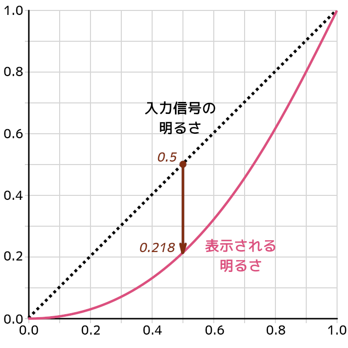
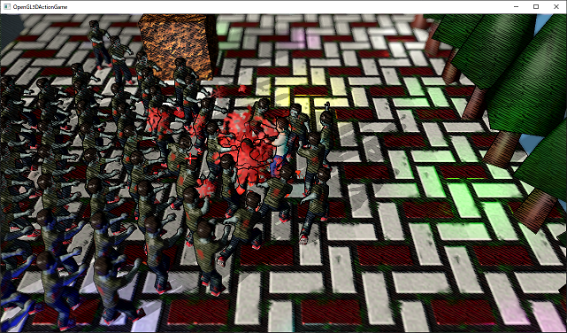

[OpenGL 3D 2021 Tips 第06回]

# SRGB色空間とガンマ補正

## 1. テクスチャをsRGBに対応させる

### 1.1 ブラウン管とガンマ補正

その昔、映像を表示する装置といえば「ブラウン管(CRT)」でした。ブラウン管は、電子を蛍光体にぶつけることで映像を映し出す装置です。ブラウン管には「発生する電子の数が、かけた電圧の2.2乗に反比例する」という特性があります。

このため、自然に見える画像をそのまま表示すると、実際よりかなり暗く見えます。画像や映像を作成するときは、この特性を考慮して撮影時より明るく補正することになっています。

この補正のことを「ガンマ補正」といいます。

次の図は、ブラウン管に入力される電圧の強さと、実際に画面に表示される明るさの関係を表しています。

<p align="center">
<br>
</p>

このように`0.5`の電圧をかけても、明るさは`0.218`にしかなりません。そこで、以下の図のようにガンマ補正によって明るさを引き上げます。

<p align="center">
<br>
</p>

ブラウン管にガンマ補正した明るさを入力することで、カーブが相殺しあって正しい明るさ(点線)で表示することができます。

201年現在、ブラウン管はほぼ液晶に取って代わられ、ほとんど見かけることもありません。しかし、過去の映像作品などを正しく表示するために、液晶モニターにもわざとブラウン管と同じ特性を持たせています。

### 1.2 ガンマ補正の問題点

単に画像を表示するだけの場合、ガンマ補正を気にすることはありません。というのは、画像や映像の制作に使うモニターも、この特性を持っているからです。特性が同じモニターを使ってデータの作成と視聴を行うかぎり、このような特性があることに気づくことはありませんし、気にする必要もありません。

問題は、画像を編集したり、3Dグラフィックスのように、ライトを物理的な計算によって表現する場合です。例えば明るさ`1.0`と`0.0`の平均を計算すると、結果は`0.5`になります。しかし、`0.5`をモニターに表示すると明るさ`0.218`相当になってしまい、中間の明るさにはなりません。

これはOpenGLのライトの計算にも影響します。物理的にはライトからの距離の2乗で明るさが低下します。例えば距離10mで明るさが`1.0`になるライトがあったとすると、距離14mでは約半分の`0.5`になるはずです。

しかし、`0.5`をモニターに入力すると、モニター特性により`0.218`として表示されてしまいます。このため、物理的に正しい明るさで表示することができません。これまで気づいていなかっただけで、みなさんが作成したプログラムも、物理的に正しい明るさで表示できていなかったのです。

ガンマ補正がかかっている限り、正しい計算は困難です。しかし、モニター特性を考慮すると、ガンマ補正を捨てるわけにもいきません。そこで、以下の手順で明るさの計算を行います。

>1. 逆ガンマ補正を行って本来の明るさに戻す。
>2. 明るさの計算を行う。
>3. ガンマ補正をやりなおす。

OpenGLでこの手順を実行するには、「sRGB対応フレームバッファ」と「sRGB対応テクスチャ」を使います。

### 1.3 GLContext::CreateImage2D関数の変更

「sRGB(エス・アールジービー)」は、国際的な色の標準規格のひとつです。2021年現在、ほとんどのデジタル映像機器がこの規格に対応しています。このsRGB規格にはガンマ補正の方法も含まれます。

OpenGLもsRGB規格に対応しており、以下の2つの機能を実装しています。

>* テクスチャのガンマ補正を解除する。
>* フレームバッファに書き込むときにガンマ補正を行う。

この2つの機能を適切に使うことで、明るさの計算を正しく行えるようになります。

テクスチャのガンマ補正を解除するには、テクスチャのGPU側のピクセル形式として`GL_SRGB8`または`GL_SRGB8_ALPHA8`を指定します。この指定をすると、作成したテクスチャをシェーダーで読み込むときに、自動的にガンマ補正が解除されます。

ただし、ガンマ補正の解除を行ってはいけない画像もあるため、常にこれらの定数を使うわけにはいきません。例えば表面の滑らかさを表すスムースネステクスチャや金属・非金属を表すメタルネステクスチャです。これらのテクスチャは本来の意味での色データを表すものではないので、ガンマ補正がかかっていないはずだからです。

そこで、`GLContext::CreateImage2D`関数に内部形式を指定する引数を追加します。引数名は`internalFormat`(インターナル・フォーマット)とします。`GLContext.h`を開き、`CreateImage2D`の宣言を次のように変更してください。

```diff
 GLuint CreatePipeline(GLuint vp, GLuint fp);
 GLuint CreateImage2D(GLsizei width, GLsizei height, const void* data,
-  GLenum format, GLenum type);
-GLuint CreateImage2D(const char* filename);
+  GLenum format, GLenum type, GLenum internalFormat);
+GLuint CreateImage2D(const char* filename, GLenum internalFormat);
 GLuint CreateSampler();

 } // namespace GLContext
```

続いて定義を変更します。`GLContext.cpp`を開き、`CreateImage2D`関数に引数を追加してください。

```diff
 * @param pixelFormat  画像のピクセル形式(GL_BGRAなど).
 * @param type    画像データの型.
+* @param internalFormat GPU側のピクセル形式.
 *
 * @retval 0以外  作成したテクスチャ・オブジェクトのID.
 * @retval 0      テクスチャの作成に失敗.
 */
 GLuint CreateImage2D(GLsizei width, GLsizei height, const void* data,
-  GLenum pixelFormat, GLenum type)
+  GLenum pixelFormat, GLenum type, GLenum internalFormat)
 {
   GLuint id;

   // テクスチャ・オブジェクトを作成し、GPUメモリを確保する.
   glCreateTextures(GL_TEXTURE_2D, 1, &id);
   if (type == GL_UNSIGNED_INT_24_8) {
     glTextureStorage2D(id, 1, GL_DEPTH24_STENCIL8, width, height);
   } else {
-    glTextureStorage2D(id, 1, GL_RGBA8, width, height);
+    glTextureStorage2D(id, 1, internalFormat, width, height);
   }
```

もうひとつの`CreateImage2D`関数も変更します。ファイル名からテクスチャを作成する`CreateImage2D`関数の定義に、次のように引数を追加してください。

```diff
 * ファイルから2Dテクスチャを読み込む.
 *
 * @param filename 2Dテクスチャとして読み込むファイル名.
+* @param internalFormat GPU側のピクセル形式.
 *
 * @retval 0以外  作成したテクスチャ・オブジェクトのID.
 * @retval 0      テクスチャの作成に失敗.
 */
-GLuint CreateImage2D(const char* filename)
+GLuint CreateImage2D(const char* filename, GLenum internalFormat)
 {
   std::ifstream ifs;
```

関数の最後を`internalFormat`を使ってテクスチャを作成するように変更します。`CreateImage2D`関数の末尾を次のように変更してください。

```diff
     pixelFormat = GL_BGR;
   }

   // 読み込んだ画像データからテクスチャを作成する.
-  return CreateImage2D(width, height, buf.data(), pixelFormat, type, GL_RGBA8);
+  return CreateImage2D(width, height, buf.data(), pixelFormat, type, internalFormat);
 }
```

### 1.4 Image2Dクラスの変更

続いて`Image2D`クラスを変更します。`Texture.h`を開き、`Image2D`クラスの定義を次のように変更してください。

```diff
 namespace Texture {
+
+/**
+* 画像データの種類.
+*/
+enum class ImageType
+{
+  framebuffer, // フレームバッファ
+  depthbuffer, // 深度バッファ
+  color,       // カラー画像
+  non_color,   // 非カラー画像(メタルネスなど)
+};

 /**
 * 2Dテクスチャ.
 */
 class Image2D
 {
 public:
   Image2D() = default;
-  explicit Image2D(const char* filename);
+  explicit Image2D(const char* filename, ImageType imageType = ImageType::color);
   Image2D(const char* name, GLsizei width, GLsizei height, const void* data,
-    GLenum format, GLenum type);
+    GLenum format, GLenum type, ImageType imageType);
   ~Image2D();
   Image2D(const Image2D&) = delete;
   Image2D& operator=(const Image2D&) = delete;
```

画像の種類を表す列挙型`ImageType`(イメージタイプ)を追加し、カラー画像と非カラー画像を指定できるようにしてみました。それでは定義を変更しましょう。`Texture.cpp`を開き、`Image2D`コンストラクタを次のように変更してください。

```diff
 * テクスチャイメージユニットにバインドされたテクスチャIDを保持する.
 */
 GLuint textureBindingState[16] = {};
+
+/**
+* 画像の種類に対応するGPU側のピクセル形式を取得する.
+*
+* @param imageType 画像の種類.
+*
+* @return imageTypeに対応するGPU側のピクセル形式.
+*/
+GLenum ToInternalFormat(ImageType imageType)
+{
+  switch (imageType) {
+  default:
+  case ImageType::framebuffer: return GL_RGBA8;
+  case ImageType::depthbuffer: return GL_DEPTH24_STENCIL8;
+  case ImageType::color:       return GL_SRGB8_ALPHA8;
+  case ImageType::non_color:   return GL_RGBA8;
+  }
+}

 /**
 * コンストラクタ.
 *
 * @param filename  2Dテクスチャとして読み込むファイル名.
+* @param imageType 画像の種類.
 */
-Image2D::Image2D(const char* filename) : name(filename),
-  id(GLContext::CreateImage2D(filename))
+Image2D::Image2D(const char* filename, ImageType imageType) :
+  name(filename),
+  id(GLContext::CreateImage2D(filename, ToInternalFormat(imageType)))
 {
```

`ToInternalFormat`(トゥ・インターナル・フォーマット)は`ImageType`を「GPU側のピクセル形式」に変換するための関数です。この関数が`GL_SRGB8_ALPHA8`を返すことで、テクスチャがsRGBに対応します。

また、フレームバッファ用のピクセル形式には、sRGBではなくこれまでと同じ`GL_RGBA8`を使います。一般的に、デフォルトフレームバッファ以外はガンマ補正を無効にして、シェーダーの出力をそのまま書き込まれるようにします。

理由は、フレームバッファには色データが書き込まれるとは限らないこと、そして、コンピュートシェーダーやCPUから書き込んだデータを利用するときに、逆ガンマ補正をしなくて済むからです。

続いて、もうひとつのコンストラクタを次のように変更してください。

```diff
 * @param pixelFormat  画像のピクセル形式(GL_BGRAなど).
 * @param type         画像データの型.
+* @param imageType    画像の種類.
 */
 Image2D::Image2D(const char* name, GLsizei width, GLsizei height, const void* data,
-  GLenum pixelFormat, GLenum type) :
+  GLenum pixelFormat, GLenum type, ImageType imageType) :
   name(name),
-  id(GLContext::CreateImage2D(width, height, data, pixelFormat, type))
+  id(GLContext::CreateImage2D(width, height, data, pixelFormat, type,
+    ToInternalFormat(imageType)))
 {
   if (id) {
```

### 1.5 Texture::CreateImage2D関数の変更

テクスチャキャッシュを利用する`Texture::CreateImage2D`関数にも`ImageType`引数を追加しましょう。`Texture.h`を開き、`CreateImage2D`関数の宣言を次のように変更してください。

```diff
   GLsizei height = 0;
 };

-std::shared_ptr<Image2D> CreateImage2D(const char*);
+std::shared_ptr<Image2D> CreateImage2D(const char*, ImageType imageType);
 void ClearTextureCache();

 void UnbindTexture(GLuint unit);
```

次に`Texture.cpp`を開き、`CreateImage2D`関数の定義を次のように変更してください。

```diff
 * 2Dテクスチャを作成する.
 *
 * @param filename  2Dテクスチャとして読み込むファイル名.
+* @param imageType 画像の種類.
 * 
 * @return 作成したテクスチャ.
 */
-std::shared_ptr<Image2D> CreateImage2D(const char* filename)
+std::shared_ptr<Image2D> CreateImage2D(const char* filename, ImageType imageType)
 {
   // キャッシュを検索し、同名のテクスチャが見つけたら、見つけたテクスチャを返す.
   auto itr = textureCache.find(filename);
   if (itr != textureCache.end()) {
     return itr->second;
   }

   // キャッシュに同名のテクスチャがなかったので、新しくテクスチャを作る.
   // 作成したテクスチャをテクスチャキャッシュに追加し、さらに戻り値として返す.
-  std::shared_ptr<Image2D> p = std::make_shared<Image2D>(filename);
+  std::shared_ptr<Image2D> p = std::make_shared<Image2D>(filename, imageType);
   textureCache.emplace(filename, p);
   return p;
```

これで`Image2D`クラスの変更は完了です。

### 1.6 画像の種類を設定する

`Image2D`クラスの引数を追加したので、テクスチャを作成するプログラムを全て修正する必要があります。ちょっと面倒ですが、がんばってやっていきましょう。まず`FramebufferObject.cpp`を開き、コンストラクタを次のように変更してください。

```diff
 FramebufferObject::FramebufferObject(int w, int h, FboType type)
 {
   texColor = std::make_shared<Texture::Image2D>("FBO(Color)", w, h, nullptr,
-    GL_RGBA, GL_UNSIGNED_BYTE);
+    GL_RGBA, GL_UNSIGNED_BYTE, Texture::ImageType::framebuffer);
   if (!texColor || !texColor->GetId()) {
     std::cerr << "[エラー]" << __func__ << ":オフスクリーンバッファ用テクスチャの作成に失敗.\n";
     texColor.reset();
     return;
   }
 
   if (type == FboType::Color) {
     glCreateRenderbuffers(1, &depthStencil);
     glNamedRenderbufferStorage(depthStencil, GL_DEPTH24_STENCIL8, w, h);
 
     glCreateFramebuffers(1, &fbo);
     glNamedFramebufferTexture(fbo, GL_COLOR_ATTACHMENT0, texColor->GetId(), 0);
     glNamedFramebufferRenderbuffer(fbo, GL_DEPTH_STENCIL_ATTACHMENT, GL_RENDERBUFFER, depthStencil);
   } else {
     texDepthStencil = std::make_shared<Texture::Image2D>("FBO(DepthStencil)", w, h, nullptr,
-      GL_DEPTH_STENCIL, GL_UNSIGNED_INT_24_8);
+      GL_DEPTH_STENCIL, GL_UNSIGNED_INT_24_8, Texture::ImageType::depthbuffer);
     if (!texDepthStencil || !texDepthStencil->GetId()) {
       std::cerr << "[エラー]" << __func__ << ":オフスクリーンバッファ用テクスチャの作成に失敗.\n";
```

`ImageType::framebuffer`と`ImageType::depthbuffer`は、この修正のためだけに作った列挙値です。特に深度バッファはかなり特別な画像データなので、完全に分けて定義したほうがよいと考えたからです。

あとは`ImageType::color`と`ImageType::non_color`のどちらかを設定するだけです。ただ、`Image2D`コンストラクタの`imageType`引数にはデフォルト引数として`ImageType::color`を指定してあります。

そのため、通常のカラー画像については何も設定する必要はありません。結果として、設定の必要があるのはメタリックスムーステクスチャだけ、ということになります。

`MainGameScene.cpp`を開き、`Initialize`メンバ関数にある、地面のメタリックスムーステクスチャを設定するプログラムを次のように変更してください。

```diff
   // 地面を表示.
   {
     std::shared_ptr<Actor> actor = std::make_shared<Actor>("ground",
       &global.primitiveBuffer.Get(GameData::PrimNo::ground), texGround, glm::vec3(0, 0, 0));
     actor->texMetallicSmoothness =
-      std::make_shared<Texture::Image2D>("Res/Ground_spec.tga");
+      std::make_shared<Texture::Image2D>("Res/Ground_spec.tga", Texture::ImageType::non_color);
     actor->SetBoxCollision(glm::vec3(-20, -10, -20), glm::vec3(20, 0, 20));
     actors.push_back(actor);
```

>**【ソリューション全体の検索を活用しよう】**<br>
>`Ctrl+Shift+F`を押すと、「検索と置換」ウィンドウを開き、ソリューション全体に対して一括検索をかけることができます。例えば、上部の検索ウィンドウに`make_shared<Texture::Image2D>`を入力し、検索場所を「ソリューション全体」にしてから「全て検索」ボタンをクリックします。すると、テクスチャを作成しているプログラムのほとんどを見つけることができます。

<div style="page-break-after: always"></div>

## 2. フレームバッファをsRGBに対応させる

### 2.1 ウィンドウヒントを指定する

OpenGLが自動的に作成するデフォルトのフレームバッファの場合、FBOのように直接GPU側のピクセル形式を指定することができません。そこで、ウィンドウヒントを使って指定します。

`Main.cpp`を開き、次のウィンドウヒントを追加してください。

```diff
   glfwWindowHint(GLFW_CONTEXT_VERSION_MAJOR, 4);
   glfwWindowHint(GLFW_CONTEXT_VERSION_MINOR, 5);
   glfwWindowHint(GLFW_OPENGL_DEBUG_CONTEXT, GLFW_TRUE);
+
+  // フレームバッファをsRGB対応にする
+  glfwWindowHint(GLFW_SRGB_CAPABLE, GLFW_TRUE);

   GLFWwindow* window =
     glfwCreateWindow(1280, 720, "OpenGL3DActionGame", nullptr, nullptr);
```

これでsRGBに対応したデフォルト・フレームバッファが作られます。

### 2.2 ガンマ補正を有効にする

次に`glEnable`関数を使ってsRGB対応機能を有効にします。sRGB対応機能は`GL_FRAMEBUFFER_SRGB`という定数として定義されています。まず`TitleScene.cpp`を開き、`Render`メンバ関数に次のプログラムを追加してください。

```diff
   glEnable(GL_DEPTH_TEST);
   glEnable(GL_CULL_FACE);
+  glEnable(GL_FRAMEBUFFER_SRGB); // ガンマ補正を有効にする
   glEnable(GL_BLEND);
   glBlendFunc(GL_SRC_ALPHA, GL_ONE_MINUS_SRC_ALPHA);
```

メインゲーム画面は少しやり方が違います。FBOはガンマ補正無効なので、FBOに書き込むときは`GL_FRAMEBUFFER_SRGB`を無効にしておく必要があります。これには`glDisable`を使います。`MainGameScene.cpp`を開き、`Render`関数に次のプログラムを追加してください。

```diff
 void MainGameScene::Render(GLFWwindow* window) const
 {
   // 描画先をフレームバッファオブジェクトに変更.
   fbo->Bind();
+  glDisable(GL_FRAMEBUFFER_SRGB); // ガンマ補正を無効にする

   GameData& gamedata = GameData::Get();
   std::shared_ptr<Shader::Pipeline> pipeline = gamedatal.pipeline;
   Mesh::PrimitiveBuffer& primitiveBuffer = gamedata.primitiveBuffer;
```

そして、描画先をFBOからデフォルトフレームバッファに戻す時に、ガンマ補正を有効にします。`Render`メンバ関数にある、描画先をデフォルトフレームバッファに戻すプログラムに、次のプログラムを追加してください。

```diff
   // 3Dモデル用のVAOをバインドしなおしておく.
   primitiveBuffer.BindVertexArray();

   // 描画先をデフォルトのフレームバッファに戻す.
   fbo->Unbind();
+  glEnable(GL_FRAMEBUFFER_SRGB); // ガンマ補正を有効にする
   glClear(GL_COLOR_BUFFER_BIT | GL_DEPTH_BUFFER_BIT | GL_STENCIL_BUFFER_BIT);

   // 2D表示.
   {
     glDisable(GL_CULL_FACE);
```

プログラムが書けたらビルドして実行してください。分かりづらいと思いますが、sRGB対応前と比べて全体的に明るめに表示されていたら成功です。

<p align="center">

</p>

<pre class="tnmai_assignment">
<strong>【課題01】</strong>
sRGBに対応してライトの明るさが正しく計算されるようになったことで、ライトの照らす見かけの範囲が広がっています。明るすぎると感じたら、明るさを減らすなどの調整をしてください。
</pre>
