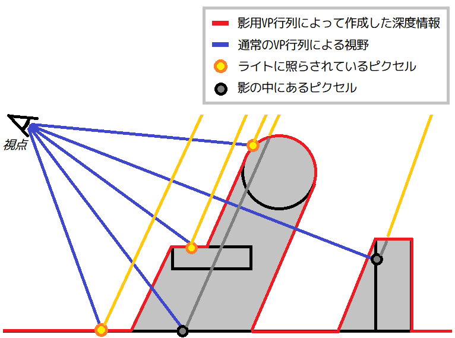
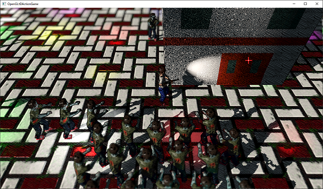

[OpenGL 3D 2021 Tips 第07回]

# デプスシャドウマッピング

## 1. デプスシャドウマッピング

### 1.1 より現実的な影を求めて

コンピューター・グラフィックス、特にゲームにおいて、適切な影を描画することは、長らく困難な問題でした。ゲームに使われるコンピューターは価格による性能限界があること、また、1/60～1/20秒という短い時間で描画を完了しなくてはならないことがその理由です。現在に至っても、真に適切な影を描画することは、非常に難易度の高い作業です。

以前のテキストで作成した「モデルを平たく変形させて影にする」という手法は、平坦な地面では非常によく機能します。また、見栄えのわりにプログラミングしやすく、処理もそんなに重くありません。

しかし、この方法では建物の壁にキャラクターの影が落ちることはありません。キャラクターが建物の影に入って暗くなる、ということも起きません。また、ちょっとでも地形が複雑になると、影が空中に浮いてしまったりします。

これらの諸問題を一挙に解決するのが「デプスシャドウマッピング」という方法です。「デプスシャドウマッピング」は以下の手順で影を描画します。

>1. 影描画用に新しいFBOを作成する。
>2. ライトの位置にカメラを置いてビュープロジェクション行列を作成し、「影描画用のFBO」に描画する。
>3. 本来の視点の位置にカメラを置いて通常の描画を行う。
>4. 頂点シェーダで、2のビュープロジェクション行列を使って座標を計算する。
>5. フラグメントシェーダで、4で計算した座標と「影用のFBO」に書き込まれたZ値を比較する。
>6. 座標がZ値より奥にある場合、描画するピクセルとライトとの間に「物体」があることを意味する。 つまり、ピクセルは「物体」の影の中にいるので、色を暗くする。
>7. 座標がZ値と同じ場合、描画するピクセルとライトとの間にはなにもない。つまり、直接ライトの光が届いているので、色はそのままにする。

<p align="center">
<br>
</p>

### 1.2 深度バッファだけのFBOを作れるようにする

影用のFBOは、深度バッファだけあれば十分です。そこで、深度バッファだけのFBOを作れるようにします。`FramebufferObject.h`を開き、`FboType`列挙型の定義を次のように変更してください。

```diff
 enum class FboType {
   Color, // カラーバッファのみ.
+  Depth, // 深度バッファのみ.
   ColorDepthStencil // カラー、深度、ステンシルバッファ.
 };
```

次に`FramebufferObject`クラスのコンストラクタを変更します。`FramebufferObject.cpp` を開き、カラーバッファを作成するプログラムを次のように変更してください。

```diff
 FramebufferObject::FramebufferObject(int w, int h, FboType type)
 {
+  if (type != FboType::Depth) {
     texColor = std::make_shared<Texture::Image2D>("FBO(Color)", w, h, nullptr,
       GL_RGBA, GL_UNSIGNED_BYTE, Texture::ImageType::framebuffer);
     if (!texColor || !texColor->GetId()) {
       std::cerr << "[エラー]" << __func__ << ":オフスクリーンバッファ用テクスチャの作成に失敗.\n";
       texColor.reset();
       return;
     }
+  }

-  if (type == FboType::ColorDepthStencil) {
+  if (type != FboType::Color) {
     // 深度ステンシルテクスチャを作成.
     texDepthStencil = std::make_shared<Texture::Image2D>(
```

次に、カラーバッファの割り当てを変更します。深度ステンシルバッファを作成するプログラムの下にある、テクスチャをFBOに割り当てるプログラムを次のように変更してください。

```diff
       texDepthStencil.reset();
       return;
     }

     // フレームバッファオブジェクトを作成.
     glCreateFramebuffers(1, &fbo);
+    if (type == FboType::Depth) {
+      glNamedFramebufferDrawBuffer(fbo, GL_NONE);
+    } else {
       glNamedFramebufferTexture(fbo, GL_COLOR_ATTACHMENT0, texColor->GetId(), 0);
+    }
     glNamedFramebufferTexture(fbo, GL_DEPTH_STENCIL_ATTACHMENT, texDepthStencil->GetId(), 0);
   }
```

これで深度バッファだけのFBOを作れるようになりました。

### 1.3 影を描画するためのFBOを追加する

それでは影描画用のFBOを追加しましょう。`MainGameScene.h`を開き、`fbo`メンバ変数の定義の下に、次のプログラムを追加してください。

```diff
   std::vector<std::shared_ptr<Sprite>> sprites;
   SpriteRenderer spriteRenderer;

   std::shared_ptr<FramebufferObject> fbo;
+  std::shared_ptr<FramebufferObject> fboShadow; // 影描画用

   Light::LightManagerPtr lightManager;
   Light::FrustumPtr frustum;
```

変数名は`fboShadow`(エフビーオー・シャドウ)としました。次に`MainGameScene.cpp`を開き、`fbo`メンバ変数を初期化するプログラムの下に、次のプログラムを追加してください。

```diff
   if (!fboMain || !fboMain->GetId()) {
     return false;
   }
+
+  // 影描画用のFBOを初期化する.
+  fboShadow = std::make_shared<FramebufferObject>(4096, 4096, FboType::Depth);
+  if (!fboShadow || !fboShadow->GetId()) {
+    return false;
+  }

   texGround = std::make_shared<Texture::Image2D>("Res/Ground.tga");
```

これで影描画用のFBOを追加することができました。

### 1.4 平行光源の定義を影描画の前に移動する

それでは`fboShadow`に描画する準備をしていきます。`MainGameScene::Render`関数に次のプログラムを追加してください。

```diff
void MainGameScene::Render(GLFWwindow* window) const
{
+
+  // 影描画用FBOに描画する.
+  {
+  }
+
   // 描画先をフレームバッファオブジェクトに変更.
   fbo->Bind();
   glDisable(GL_FRAMEBUFFER_SRGB); // ガンマ補正を無効にする
```

ところで、デプスシャドウマッピングといえども、あらゆる影を描画できるというわけではありません。一般的には平行光源、またはシーンの代表的なポイントライトやスポットライトが作り出す影だけを扱います。

今回は平行光源の影を描画することにします。影の向きを知るためには平行光源の方向が分かっていなくてはなりません。そこで、平行光源のデータを影描画の手前に移動します。

まず平行光源の定義を`Ctrl+X`などで切り取ってください。

```diff
   // 環境光を設定する.
   pipeline3D->SetAmbientLight(glm::vec3(0.1f, 0.125f, 0.15f)); // 昼

   // 平行光源を設定する
-  const Shader::DirectionalLight directionalLight{
-    glm::normalize(glm::vec4(3,-2,-2, 0)),
-    glm::vec4(glm::vec3(1, 0.9f, 0.8f) * 0.5f, 1)
-  };
   pipeline3D->SetLight(directionalLight);
```

次に切り取った定義を`Render`メンバ関数の先頭に貼り付けてください。

```diff
void MainGameScene::Render(GLFWwindow* window) const
{
+  const Shader::DirectionalLight directionalLight{
+    glm::normalize(glm::vec4(3,-2,-2, 0)),
+    glm::vec4(glm::vec3(1, 0.9f, 0.8f) * 0.5f, 1)
+  };

   // 影描画用FBOに描画する.
   {
   }
```

### 1.5 影描画の下準備

影描画用のFBOへ描画するために、OpenGLの機能を有効化、または無効化します。<br>
例えば`fboShadow`には深度バッファしかないので、カラーバッファのアルファブレンドやガンマ補正は無効化しておきます。深度バッファへの描画なので、深度テストと裏面カリングは有効にします。

ということで、次のように、影描画用FBOに描画するプログラムを追加してください。

```diff
   // 影描画用FBOに描画する.
   {
+    // 描画先を影描画用FBOに変更.
+    fboShadow->Bind();
+
+    glDisable(GL_FRAMEBUFFER_SRGB); // ガンマ補正を無効にする.
+    glDisable(GL_BLEND); // アルファブレンドを無効にする.
+    glEnable(GL_DEPTH_TEST); // 深度テストを有効にする.
+    glEnable(GL_CULL_FACE); // 裏面カリングを有効にする.
+
+    // 深度バッファをクリア.
+    glClear(GL_DEPTH_BUFFER_BIT);
   }

   // 描画先をフレームバッファオブジェクトに変更.
   fbo->Bind();
```

次にVAOとプログラムパイプラインをバインドします。深度バッファをクリアするプログラムの下に、次のプログラムを追加してください。

```diff
     // 深度バッファをクリア.
     glClear(GL_DEPTH_BUFFER_BIT);
+
+    GameData& gamedata = GameData::Get();
+
+    gamedata.primitiveBuffer.BindVertexArray();
+    std::shared_ptr<Shader::Pipeline> pipelineShadow = gamedata.pipelineShadow;
+    pipelineShadow->Bind();
   }

   // 描画先をフレームバッファオブジェクトに変更.
   fbo->Bind();
```

### 1.6 ビュープロジェクション行列を作成する

続いて、ビュープロジェクション行列を作成します。平行光源から影を作り出す場合、
`glm::ortho`(ジーエルエム・オルソ)による平行投影行列を使います。

この時設定する描画範囲は、通常の描画でつかうカメラがどの程度の範囲を映し出すかによって変わります。本テキストのプログラムを特に変更していなければ、マップは40x40mの大きさのはずです。

プレイヤーがマップの端まで行くことを考慮したとしても、プレイヤーの前後左右50mの範囲が描画されていれば十分でしょう。ライトはシーンのどの物体より手前にあるはずなので、視点座標は100m手前に配置します。

これらを踏まえて、プログラムパイプラインをバインドするプログラムの下に、次のプログラムを追加してください。

```diff
     gamedata.primitiveBuffer.BindVertexArray();
     std::shared_ptr<Shader::Pipeline> pipelineShadow = gamedata.pipelineShadow;
     pipelineShadow->Bind();
+
+    // プロジェクション行列を作成.
+    const float halfW = 50;
+    const float halfH = 50;
+    const glm::mat4 matProj =
+      glm::ortho(-halfW, halfW, -halfH, halfH, 50.0f, 200.0f);
+
+    // ビュー行列を作成.
+    const glm::vec3 viewPosition =
+      playerActor->position - glm::vec3(directionalLight.direction) * 100.0f;
+    const glm::vec3 viewTarget = playerActor->position;
+    const glm::mat4 matView =
+      glm::lookAt(viewPosition, viewTarget, glm::vec3(0, 1, 0));
   }

   // 描画先をフレームバッファオブジェクトに変更.
   fbo->Bind();
```

最後に作成した`matProj`と`matView`をかけ合わせてビュープロジェクション行列を作成します。この行列のことを「シャドウ行列」と呼ぶことにします。

そして、シャドウ行列を使ってアクターを描画します。プロジェクション行列を作成するプログラムの下に、次のプログラムを追加してください。

```diff
     const glm::vec3 viewTarget = playerActor->position;
     glm::mat4 matView =
       glm::lookAt(viewPosition, viewTarget, glm::vec3(0, 1, 0));
+
+    // アクターを描画.
+    const glm::mat4 matShadowVP = matProj * matView; // シャドウ行列.
+    for (size_t i = 0; i < actors.size(); ++i) {
+      actors[i]->Draw(*pipelineShadow, matShadowVP, Actor::DrawType::shadow);
+    }
   }

   // 描画先をフレームバッファオブジェクトに変更.
   fbo->Bind();
```

これで影描画用FBOへの描画は完成です。

### 1.7 頂点シェーダーに影描画機能を追加する

ここからは、シェーダーに影の判定を行う機能を追加していきます。頂点シェーダーから始めましょう。頂点シェーダーでは以下の作業を行います。

>1. シャドウ行列を使ってライトから見た頂点座標を計算。
>2. 計算した頂点座標をフラグメントシェーダーに送る。

これらの計算を頂点シェーダーで行っている理由は、処理速度の観点から、頂点シェーダーでもフラグメントシェーダーでもできることは、頂点シェーダーで行うべきだからです。

それでは、計算に必要なシャドウ行列と、計算結果をフラグメントシェーダーに送るための `out`変数を追加しましょう。`FragmentLighting.vert`を開き、次のプログラムを追加してください。

```diff
 layout(location=1) out vec2 outTexcoord;
 layout(location=2) out vec3 outPosition;
 layout(location=3) out vec3 outNormal;
+layout(location=4) out vec4 outShadowPosition;
 out gl_PerVertex {
   vec4 gl_Position;
 };

 // ユニフォーム変数
 layout(location=0) uniform mat4 matMVP;
 layout(location=1) uniform mat4 matModel;
 layout(location=8) uniform vec4 objectColor;
 layout(location=10) uniform vec3 morphWeight;
+layout(location=11) uniform mat4 matShadow; // シャドウ行列.

 // 頂点シェーダプログラム
 void main()
```

次に`main`関数に次のプログラムを追加してください。

```diff
   outPosition = vec3(matModel * vec4(position, 1));
   mat3 matNormal = transpose(inverse(mat3(matModel)));
   outNormal = matNormal * normal;
+  outShadowPosition = matShadow * vec4(outPosition, 1.0);

   gl_Position = matMVP * vec4(position, 1.0);
 }
```

これでライトから見た頂点座標が、フラグメントシェーダーに送られるようになります。

### 1.8 フラグメントシェーダーに影描画機能を追加する

続いてフラグメントシェーダーに影の判定を行う機能を追加します。これは次の手順で判定します。

>1. ライトから見た頂点座標を使って影描画用FBOの値を読み取る。
>2. ライトから見た頂点座標のZ値と影描画用FBOの値を比較。
>3. Z値のほうが大きければ影の中にいる。小さければ影の外にいる。

まずは「ライトから見た頂点座標」を受け取る入力変数と、影描画用FBOをバインドするテクスチャサンプラを追加します。`FragmentLighting.frag`を開き、次のプログラムを追加してください。

```diff
 layout(location=1) in vec2 inTexcoord;
 layout(location=2) in vec3 inPosition;
 layout(location=3) in vec3 inNormal;
+layout(location=4) in vec4 inShadowPosition;

 // 出力変数
 out vec4 fragColor;

 // ユニフォーム変数
 layout(binding=0) uniform sampler2D texColor;
 layout(binding=1) uniform sampler2D texNormal;
 layout(binding=2) uniform sampler2D texMetallicSmoothness;
+layout(binding=4) uniform sampler2D texShadow;

 // 平行光源
 struct DirectionalLight {
```

追加した変数を使って、フラグメントが影の中にいるかどうかを調べましょう。正規化係数を計算するプログラムの下に、次のプログラムを追加してください。

```diff
   // Blinn-Phong反射モデルの正規化係数を計算.
   float normalizationFactor = (shininess + 8) / (8.0 * PI);
+
+  // 影の濃さを調べる
+  float z = inShadowPosition.z / inShadowPosition.w;
+  float shadow = float(textureProj(texShadow, inShadowPosition.xyw).r > z);

   vec3 viewVector = normalize(viewPosition - inPosition); // 視線ベクトル
   vec3 worldNormal = computeNormal(viewVector);
   vec3 totalLightColor = ambientLight;
```

影の判定には`textureProj`(テクスチャ・プロジェ)関数を使います。この関数は、3番目のベクトル値を使って指定された座標をテクスチャに投影し、そのテクセルの値を返します。3番目のベクトル値には`w`を指定します。

ライトから見た頂点座標はパースがかかっている可能性があります。正しいテクスチャ座標に変換するには`w`要素で除算しなくてはなりません。`textureProj`はこれを自動的に行なってくれます。プログラム的には以下のコードと同じです。

`texture(texShadow, inShadowPosition.xy / inShadowPosition.w).r`

`textureProj`の利点は、計算コストのかかる除算を関数側で処理してくれるところです。平行投影なら`w`は常に`1`なので除算なしで`texture`関数を使うことができます。透視投影にも対応するなら、`textureProj`関数を使うか、自前で除算する必要があります。

また、透視投影の場合は`z`要素にもパースがかかっているので、比較する前に`w`で除算しておかなくてはなりません。比較結果は`shadow`(シャドウ)変数に代入されます。
`shadow`が`0`なら「影の中」、`1`なら「影の外」です。

あとは`shadow`変数を使って明るさを修正します。平行光源を計算するプログラムを、次のように変更してください。

```diff
   // 平行光源
   {
     float F = Fresnel(f0, -directionalLight.direction.xyz, viewVector);
 
     float theta = max(dot(worldNormal, -directionalLight.direction.xyz), 0);
-    totalLightColor += directionalLight.color.rgb * theta * (1 - F);
+    totalLightColor += directionalLight.color.rgb * theta * shadow * (1 - F);
 
-    totalSpecularColor += directionalLight.color.rgb * theta *
+    totalSpecularColor += directionalLight.color.rgb * theta * shadow *
       computeSpecular(-directionalLight.direction.xyz, worldNormal, viewVector,
       shininess, normalizationFactor) * F;
   }
```

これでフラグメントシェーダーの変更は完了です。

### 1.9 シャドウ行列を設定する機能を追加する

`Pipeline`クラスに、シェーダーのシャドウ行列を設定する機能を追加します。`Shader.h`を開き、次のプログラムを追加してください。

```diff
   void Unbind() const;
   bool SetMVP(const glm::mat4&) const;
   bool SetModelMatrix(const glm::mat4&) const;
+  bool SetShadowMatrix(const glm::mat4&) const;
   bool SetLight(const DirectionalLight& light) const;
   bool SetLight(const PointLight& light) const;
   bool SetAmbientLight(const glm::vec3& color) const;
```

次に`Shader.cpp`を開き、`SetModelMatrix`関数の定義の下に、次のプログラムを追加してください。

```diff
   }
   return true;
 }
+
+/**
+* シェーダにシャドウ行列を設定する.
+*
+* @param matShadow 設定するシャドウ行列.
+*
+* @retval true  設定成功.
+* @retval false 設定失敗.
+*/
+bool Pipeline::SetShadowMatrix(const glm::mat4& matShadow) const
+{
+  glGetError(); // エラー状態をリセット.
+
+  const GLint locMatShadow = 11;
+  glProgramUniformMatrix4fv(vp, locMatShadow, 1, GL_FALSE, &matShadow[0][0]);
+  if (glGetError() != GL_NO_ERROR) {
+    std::cerr << "[エラー]" << __func__ << ":シャドウ行列の設定に失敗.\n";
+    return false;
+  }
+  return true;
+}

 /**
 * シェーダにライトデータを設定する.
```

### 1.10 シャドウ行列を設定する

さっそくシャドウ行列を設定しましょう。`MainGameScene.cpp`を開き、`Render`メンバ関数に次のプログラムを追加してください。

```diff
     for (size_t i = 0; i < actors.size(); ++i) {
       actors[i]->Draw(*pipelineShadow, matShadowVP, Actor::DrawType::shadow);
     }
+
+    // クリップ座標系からテクスチャ座標系への座標変換行列を追加.
+    const glm::mat4 matShadowTexture = glm::mat4(
+      0.5f, 0.0f, 0.0f, 0.0f,
+      0.0f, 0.5f, 0.0f, 0.0f,
+      0.0f, 0.0f, 0.5f, 0.0f,
+      0.5f, 0.5f, 0.5f, 1.0f
+    ) * matShadowVP;
+
+    // 影用の座標変換行列を通常描画用のシェーダーに設定.
+    gamedata.pipeline3D->SetShadowMatrix(matShadowTexture);
   }

   // 描画先をフレームバッファオブジェクトに変更.
   fbo->Bind();
```

このプログラムでは、シャドウ行列に奇妙な行列を掛けています。これは「クリップ座標系からテクスチャ座標系へ変換する」行列です。

シャドウ行列は「ワールド座標系からクリップ座標系へ変換」する行列ですが、テクスチャを読む時に必要なのはテクスチャ座標系の座標です。そのため、クリップ座標系からテクスチャ座標系へ変換する行列を掛ける必要があるわけです。

さて、クリップ座標系は`-1`～`+1`の範囲を持つ座標系です。そして、テクスチャ座標系は
`0`～`1`の範囲を持つ座標系です。この事実から、クリップ座標系からテクスチャ座標系の変換は「座標を`0.5`倍して`0.5`を足す」ことで実現できることがわかります。

これが、「`0.5`倍して`0.5`を足す」行列を掛けている理由です。

### 1.11 シャドウテクスチャを設定する

最後に、影描画用FBOの深度バッファ(その用途から「シャドウテクスチャ」と呼ばれます)をシェーダーにバインドします。通常描画を行うプログラムに、次のプログラムを追加してください。

```diff
   pipelineDeathEffect->SetLight(directionalLight);
   pipelineDeathEffect->SetViewPosition(playerActor->position + glm::vec3(0, 7, 7));
+
+  // シャドウテクスチャをバインド.
+  fboShadow->BindDepthStencilTexture(4);

   const glm::mat4 matVP = matProj * matView;
   for (size_t i = 0; i < actors.size(); ++i) {
     actors[i]->Draw(matVP, Actor::DrawType::color);
```

そして最後に、ぺちゃんこ行列を使った影の描画を無効化します。以前の影描画プログラムを次のように変更してください。

```diff
   // アクターの影を描画.
-  {
+  if (0) {
     // ステンシルバッファを有効にする.
     glEnable(GL_STENCIL_TEST);
```

プログラムが書けたらビルドして実行してください。建物にプレイヤーの影が落ちていたら成功です。

<p align="center">

</p>

<div style="page-break-after: always"></div>

## 2. 影の品質を上げる

### 2.1 シャドウアクネ

キャラクターや建物の表面がやたらと汚れているのは、シャドウテクスチャと通常描画の角度が違うからです。次の図が示すように、シャドウ行列と画面を表示するときのビュープロジェクション行列は、違う角度から描画を行います。

<p align="center">

</p>

一般的に、シャドウテクスチャは画面に映る範囲より広い空間を処理する必要があるため、通常の画面描画より解像度が低くなります。すると、シャドウテクスチャから読み取ったZ値と表示するフラグメントのZ値が一致しないケースが出てきます。

このような、精度の問題によって発生する物体表面の汚れは「シャドウアクネ(影のにきび)」と呼ばれています。

簡単な解決方法は、画面に描画するときの座標を外側に少しずらすことです。ずらすことで実際の位置より手前で影の判定を行うことになります。結果として下図のようにシャドウアクネがなくなります。

<p align="center">

</p>

これは、頂点座標を法線方向に少しだけ移動させることで実現できます。
`FragmentLighting.vert`を開き、ライトから見た頂点座標を計算するプログラムを、次のように変更してください。

```diff
   outPosition = vec3(matModel * vec4(position, 1));
   mat3 matNormal = transpose(inverse(mat3(matModel)));
   outNormal = matNormal * normal;
-  outShadowPosition = matShadow * vec4(outPosition, 1.0);
+  outShadowPosition = matShadow * vec4(outPosition + outNormal * 0.025, 1.0);

   gl_Position = matMVP * vec4(position, 1.0);
 }
```

ずらす距離にはピクセルの実サイズを使いました。ピクセルの実サイズは<br>
`平行投影行列の描画範囲(100m)÷テクスチャのピクセル数(4096)`<br>
として求めることができます。

プログラムが書けたらビルドして実行してください。シャドウアクネが消えていたら成功です。

>**【ずらす距離について】**<br>
>ずらす量が大きすぎると、影になるべき部分が影にならない場合が出てくるので注意が必要です。かといって、小さすぎるとシャドウアクネが消えません。

<p align="center">

</p>

### 2.2 影をぼかす

シャドウアクネは消えました。今度は影の輪郭がカクカクしているのを緩和します。これには被写界深度のときにも利用した「ポアソンディスクサンプリング」を使います。

`FragmentLighting.frag`を開き、次のプログラムを追加してください。

```diff
 // 視点座標
 layout(location=7) uniform vec3 viewPosition;
+
+// 影をぼかすためのサンプリング座標.
+const int poissonSampleCount = 4;
+const vec2 poissonDisc[poissonSampleCount] = {
+  { -0.94201624, -0.39906216 },
+  { 0.94558609, -0.76890725 },
+  { -0.094184101, -0.92938870 },
+  { 0.34495938, 0.29387760 },
+};

 const uvec2 screenSize = uvec2(1280, 720); // 画面の大きさ.
 const uvec2 tileCount = uvec2(8, 4); // 視錐台の分割数.
```

続いて影の濃さを調べるプログラムに、次のプログラムを追加してください。

```diff
   // 影の濃さを調べる
   float z = inShadowPosition.z / inShadowPosition.w;
   float shadow = float(textureProj(texShadow, inShadowPosition.xyw).r > z);
+  vec2 shadowTexelSize = vec2(1.0) / textureSize(texShadow, 0);
+  for (int i = 0; i < poissonSampleCount; ++i) {
+    vec3 texcoord = inShadowPosition.xyw;
+    texcoord.xy += poissonDisc[i] * shadowTexelSize;
+    shadow += float(textureProj(texShadow, texcoord).r > z);
+  }
+  shadow *= 1.0 / float(poissonSampleCount + 1);

   vec3 viewVector = normalize(viewPosition - inPosition); // 視線ベクトル
   vec3 worldNormal = computeNormal(viewVector);
   vec3 totalLightColor = ambientLight;
```

プログラムが書けたらビルドして実行してください。影の輪郭が多少ぼんやりとしていたら成功です。

<p align="center">

</p>

<pre class="tnmai_assignment">
<strong>【課題01】</strong>
<code>FragmentLighting.frag</code>に追加した影の濃さを求めるプログラムを、<code>DeathEffect.frag</code>にも追加しなさい。
</pre>

<pre class="tnmai_assignment">
<strong>【課題02】</strong>
被写界深度のプログラムを参考にして、影をぼかすためのサンプル数を増やしなさい。
</pre>
