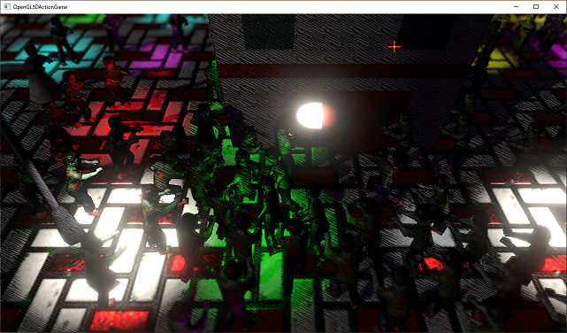
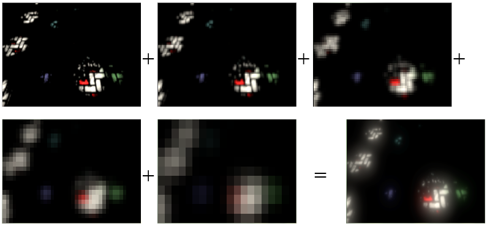

[OpenGL 3D 2021 Tips 第08回]

# <ruby>光<rt>ひか</rt></ruby>る世界

## 1. ブルームエフェクト

<p align="center">

</p>

### 1.1 浮動小数点数フレームバッファ

強い光を出す物体やライト、またはそのようなライトに照らされた明るい物体があると、その周囲に光があふれだすような現象が起きます。

これは以下の2つの光学現象によって引き起こされます。

>1. 光の<ruby>回折<rt>かいせつ</rt></ruby>
>2. 空気中の分子や<ruby>塵<rt>ちり</rt></ruby>による散乱

これらの光学現象は「ブルーム」や「フレア」と呼ばれます。ブルームのような光学現象では、光の広がる範囲が「正規分布」することが分かっています。

正規分布は以前「ぼかしフィルタ」で使用した手法です。つまり、「ぼかしフィルタ」を使えばブルームを表現できるわけです。

残る問題は、「強い光」や「明るい物体」をどうやって見分けるかということです。これは`FBO`のフォーマットを変更することで対応できます。

現在の`FBO`は、カラーバッファを`RGBA8`フォーマットで作成しています。`RGBA8`で表現できる明るさの範囲は`0～1`です。しかし、これは現実の明るさを再現するには範囲が狭すぎます。例えば、電球と太陽を直接見たときの明るさは次のとおりです。

>| 光源       | 明るさ(カンデラ)                       |
>|:----------:|---------------------------------------:|
>| 電球(100W) |                                    127 |
>| 太陽       |  3'150'000'000'000'000'000'000'000'000 |
>| 月         |                  6'400'000'000'000'000 |
>
>出典: `https://www.tlt.co.jp/tlt/lighting_design/design/basic/data/1_3.pdf`

太陽ヤバイ。

これほど明るさが違うのに、`RGBA8`フォーマットの`FBO`に書き込まれる明るさは、電球も太陽も`1`になります。`RGBA8`では、本来の明るさを表すことができないのです。

そこで、フォーマットを`RGBA16F`(アールジービーエー・じゅうろく・エフ)に変更することにします。`RGBA16F`は「16ビット浮動小数点数フォーマット」で、表現できる最大値は`65504`です。

`RGBA16F`を使っても、太陽の明るさを再現するには遠く及びません。しかし、電球と太陽の明るさの違いを表現することは可能です。

>**【RGBA8とRGBA16Fの使い分けについて】**<br>
>`RGBA16F`は各色16ビットのフォーマットなので、1ピクセルに8バイト(64ビット)必要です。`RGBA8`は各色8ビットなので、1ピクセルは4バイトで済みます。<br>
>これは必要なGPUメモリのサイズが倍になることを意味します。さらに、ピクセルを読み書きするときに、2倍のデータを扱う必要があります。これらの影響で、`RGBA8`に比べると`RGBA16F`の描画性能は低くなります。<br>
>GPUの性能を最大に引き出すことを目指すなら、`RGBA16F`フォーマットを使うのは本当に必要な場合だけに限るべきです。<br>
>なお、いいとこ取りを目指した`RGB10_A2UI`、`R11F_G11F_B10F`、`RGB9_E5`といったフォーマットも存在します。これらはアルファ値の精度を犠牲にすることで、サイズを4バイトに保ったまま`1`を超える数値を扱えるようになっています。

それでは`FBO`を`RGBA16F`に変更しましょう。`Texture.cpp`を開き、`ToInternalFormat`関数を次のように変更してください。

```diff
 GLenum ToInternalFormat(ImageType imageType)
 {
   switch (imageType) {
-  default:
-  case ImageType::framebuffer: return GL_RGBA8;
+  default: return GL_RGBA8;
+  case ImageType::framebuffer: return GL_RGBA16F;
   case ImageType::depthbuffer: return GL_DEPTH24_STENCIL8;
   case ImageType::color:       return GL_SRGB8_ALPHA8;
   case ImageType::non_color:   return GL_RGBA8;
   }
 }
```

これで`FBO`のカラーバッファが`RGBA16F`で作成されるようになります。プログラムが書けたらビルドして実行してください。フォーマットを変えただけなので、見た目はほとんど変わりませんす。

精度が上がったために、グラデーションが少し綺麗になるくらいでしょう。しかし、内部的には「`1`より大きい数値」が格納されているはずです。

### 1.2 明るい部分を取り出す

カラーバッファに「`1`より大きい数値」を格納できるようになったので、次は`1`以上のピクセルだけを取り出します。そのために新しいシェーダーを作成します。

このシェーダーがやることは「ある値(あたい)を超える「明るい成分」だけを残し、残りは黒にする」です。なお、以後は「ある値」のことを「<ruby>閾値<rt>しきいち</rt></ruby>」と呼ぶことにします。

さて、単純に考えると、

>明るい成分 = 輝度 - 閾値

とすれば、目的を達せられるように思えます。実際、これは正しい方法のひとつです。しかし、例えば「わずかにオレンジ色を帯びた明るい赤`(2.0, 0.5, 0.0)`」の場合を考えてみましょう。

閾値を`1.0`とすると、式の結果は`(1.0, 0.0, 0.0)`です。緑成分が完全に失われ、赤成分だけになってしまっています。より正確な色を表現するためには、もう少し複雑な式にする必要がありそうです。

まず、明るさの定義を「RGBのうちもっとも明るい要素の明るさ」とします。そして、以下の式で「明るい成分の比率」を求めます。

>明るい成分の比率 = (明るさ - 閾値) / 明るさ ・・・式1

そして、元の色に「明るい成分の比率」を掛けた結果を「明るい成分」とします。

>明るい成分 = 元の色 * 明るい成分の比率 ・・・式2

この式ならより正確な色になるはずです。さきほどの「オレンジ色を帯びた赤」で計算してみましょう。RGBのうちもっとも明るいのは赤の`2.0`なので、これを「明るさ」とします。これを式1に代入すると、「明るい成分の比率」は`0.5`になります。

`0.5`を式2に代入すると、結果は`(1.0, 0.25, 0.0)`です。さっきは消えてしまった緑成分を残すことができました！

それではこの式をシェーダーにしていきます。`Res`フォルダに`Filter_HighBrightness.frag`(フィルター・ハイ・ブライトネス・フラグ)というファイルを追加してください。追加したファイルを開き、次のプログラムを追加してください。

```diff
+#version 450
+
+// 入力変数
+layout(location=1) in vec2 inTexCoord;
+
+// 出力変数
+out vec4 fragColor;
+
+// ユニフォーム変数
+layout(binding=0) uniform sampler2D texColor;
+
+const float threshold = 1.0; // 明るいと判定する閾値.
+
+// フラグメントシェーダプログラム
+void main()
+{
+  // 読み取り座標をずらす距離を計算.
+  vec4 unitSize;
+  unitSize.xy = vec2(0.75) / vec2(textureSize(texColor, 0));
+  unitSize.zw = -texelSize.xy;
+
+  // 簡易ぼかしフィルタ(4x4テクセルの平均を計算)
+  fragColor.rgb = texture(texColor, inTexCoord + unitSize.xy).rgb;
+  fragColor.rgb += texture(texColor, inTexCoord + unitSize.zy).rgb;
+  fragColor.rgb += texture(texColor, inTexCoord + unitSize.xw).rgb;
+  fragColor.rgb += texture(texColor, inTexCoord + unitSize.zw).rgb;
+  fragColor.rgb *= 0.25; // 平均を求めるため1/4にする.
+  fragColor.a = 1.0;
+
+  // RGBのうちもっとも明るい成分をピクセルの明るさとする.
+  float brightness = max(fragColor.r, max(fragColor.g, fragColor.b));
+
+  // 明るい成分の比率を計算.
+  float highBrightnessPart = max(brightness - threshold, 0.0);
+  float ratio = highBrightnessPart / max(brightness, 0.00001);
+
+  // 明るい成分を計算.
+  fragColor.rgb *= ratio;
+}
```

最初に「簡易的なぼかしフィルタ」を実行します。これは4x4テクセルの平均を取るだけのフィルタです(テクセルは「テクスチャのピクセル」を意味するGC用語)。範囲が狭いのは、あまり計算コストをかけたくないからです。

`unitSize`(ユニットサイズ)変数は、ぼかしフィルタを実行するために「読み取り座標をずらす距離」です。ずらす距離を0.75テクセルにすると、4x4テクセルを読み取る時にちょうどいい位置にずらすことができます。

`unitSize`を求めたらぼかしフィルタを実行します。サンプラのフィルタモードを`GL_LINEAR`にしておくと、一度の読み取りで4つのテクセルの平均値が得られるようになります。4回の読み取ることで4x4テクセルの平均を求めています。

次にピクセルの明るさを計算します。ピクセルの明るさには「RGBのうちもっとも明るい成分」を使います。

最後に「明るい成分」を計算します。この計算自体は少し上で説明した式そのものですが、`max`関数による処理を追加しています。`max(brightness - threshold, 0.0)`では、明るさの値を0以上にするために`max`関数を使っています。

これが必要なのは、`RGBA16F`にはマイナスの値を書き込むことができるからです。閾値以下を切り捨てる場合、`max`関数によって最小値を保証する必要があります。

`max(brightness, 0.00001)`の`max`関数は「ゼロによる除算」を避けるためのものです。

<pre class="tnmai_assignment">
<strong>【課題01】</strong>
<code>GameData</code>クラスに<code>Filter_HighBrightness.frag</code>を使った、新しいパイプラインオブジェクトを追加しなさい。
パイプラインオブジェクトの名前は<code>pipelineHighBrightness</code>としなさい。
頂点シェーダには<code>Simple.vert</code>を使いなさい。
</pre>

>**【ゼロ除算を避けるテクニック】**<br>
>ゼロ除算を避けるテクニックには、ここで使用した`max`関数の他に、「ごく小さな数値を足す」という方法もよく使われます。`if`を使うこともできますが、シェーダーにおける`if`は、処理速度を低下させる可能性が高いので、あまり使われません。

### 1.3 専用サンプラの追加

作成したシェーダーを使うときは、フィルタモードが`GL_LINEAR`になっていなくてはなりません。また、ラップモードが`GL_REPEAT`だと、ぼかしフィルタを実行したときに画面の逆サイドの情報を参照してしまいます。

これらの事情から、既存のサンプラを流用するのはあまり良い考えではありません。そこで、エフェクト専用のサンプラを追加しようと思います。変数名は`samplerPostEffect`(サンプラ・ポスト・エフェクト)とします。

なお、この場合の「ポスト」は「(順番、時間が)後の」という前置詞です。`post effect`は「後から実行するエフェクト」という意味になります。「後から実行するエフェクト用のサンプラ」というわけです。

それでは、`GameData.h`を開き、次のプログラムを追加してください。

```diff
   std::shared_ptr<Shader::Pipeline> pipelineHighBrightness;
   Mesh::PrimitiveBuffer primitiveBuffer;
   Texture::Sampler sampler;
+  Texture::Sampler samplerPostEffect;

   // 乱数生成用のメンバ変数.
   std::mt19937 random;
```

続いて`GameData.cpp`を開き、`Initialize`メンバ関数に次のプログラムを追加してください。

```diff
   // サンプラ・オブジェクトの初期設定をする.
   sampler.SetWrapMode(GL_REPEAT);
   sampler.SetFilter(GL_LINEAR);
+  samplerPostEffect.SetWrapMode(GL_CLAMP_TO_EDGE);
+  samplerPostEffect.SetFilter(GL_LINEAR);

   // ゲームデータ経由で使えるようにウィンドウ変数を保存.
   this->window = window;
```

これでサンプラを準備できました。

### 1.4 <ruby>川瀬式<rt>かわせしき</rt></ruby>MGF(マルチプル・ガウシアン・フィルタ)

現在の「ぼかしフィルタ」の処理範囲は5x5ピクセルで、これはあまり広いとはいえません。そのため、見栄えのよいブルームを作るには、フィルタのぼかし範囲を拡大するか、何度もぼかしフィルタを実行する必要があります。

しかし、「ぼかしフィルタ」はあまり軽い処理ではないため、何度も実行するとゲームの動作速度が低下してしまいます。

見栄えのよいブルームを実現するには、動作速度を下げない程度の処理時間で、十分な広さをぼかすという、ちょっと聞くだけでは無理っぽいことをやらなくてはなりません。

そこで「川瀬式MGF(かわせしき・エムジーエフ、かわせしき・マルチプル・ガウシアン・フィルタ)」、と呼ばれるテクニックを使うことにします。

>川瀬氏によるGDC2004発表資料(日本語)。ブルーム(グレア)については44ページを参照。2004年当時の話なので、現在は解決している、またはより良い技術が見つかっている部分も多い点に注意。<br>
>`http://www.daionet.gr.jp/~masa/archives/GDC2004/GDC2004_PIoHDRR_JP.ppt`

「川瀬式MGF」は、名前に「マルチプル」とあるように複数回のぼかしフィルタを実行します。ただし、ぼかしフィルタを実行するたびに、面積を1/4に縮小したFBOへ書き込みます。

つまり元のフレームバッファサイズが1280x720の場合、まず640x360のカラーバッファに書き込み、2回目のぼかしでは640x360から320x180へ、3回目は320x180から160x90へというように、徐々に縮小していくわけです。

<p align="center">
<br>
[川瀬式MGFの実行例]
</p>

ぼかしフィルタを実行するごとに縮小していくのは、縮小によって以下の利点が得られるからです。

>**【利点】**
>
>* 描画するピクセル数が減るため、処理が早く完了する(1/4なら4倍早くなる)。
>* ぼかしフィルタを変えることなく、より広い範囲にぼかしを広げることができる(1/4なら4倍の面積をぼかすことができる)

もちろん、利点だけというわけにはいきません。縮小には次の欠点もあります。

>**【欠点】**
>
>* 細部の情報が失われる(1/4なら4ピクセルの平均になってしまう→情報量が1/4になる)

しかし、ぼかしフィルタの場合はこの欠点を無視できます。なぜなら、ぼかしの目的は「細部の情報をぼかす(失わせる)」ことだからです。情報量が減ることが利点に変わるわけです。

こうして十分な回数のぼかしを実行したら、すべてのカラーバッファを合計して平均を求め、最終画像に加算します。

まとめると、やることは次のとおりです。

>1. 元画像の1/4, 1/16, 1/64, ...のサイズの`FBO`を作成。
>2. `pipelineHighBrightness`を使って「明るい成分」を1/4サイズの`FBO`に抽出。
>3. `pipelineBlur`を使って、2で抽出した「明るい成分」をぼかして、1段階小さい`FBO`に書き込むことを繰り返す。
>4. `pipeline2D`を使って、3ぼかした画像を1段階大きい`FBO`に加算することを繰り返す。
>5. `pipelinePencil`に、4で加算合成した`FBO`を加算するプログラムを追加。

### 1.5 ブルーム用FBOの追加

それでは`FBO`を作成しましょう。`MainGameScene.h`を開き、`fboShadow`メンバ変数の定義の下に、次のプログラムを追加してください。

```diff
   std::shared_ptr<FramebufferObject> fbo;
   std::shared_ptr<FramebufferObject> fboShadow; // 影描画用
+  std::shared_ptr<FramebufferObject> fboBloom[6]; // ブルームエフェクト用

   Light::LightManagerPtr lightManager;
   Light::FrustumPtr frustum;
```

今回は6個の`FBO`を作成することにしました。縮小しすぎると見た目に影響するレベルで詳細情報が失われてしまうため、数を増やせばいいというものでもありません(例えば1x1まで縮小するのはやりすぎです)。元画像が1280x720の場合は4～6個程度がよいと思います。

次に`FBO`を作成します。`MainGameScene.cpp`を開き、`Initialize`メンバ関数の影用`FBO`を作成するプログラムの下に、次のプログラムを追加してください。

```diff
   if (!fboShadow || !fboShadow->GetId()) {
     return false;
   }
+
+  // ブルームエフェクト用のFBOを作成.
+  int bloomW = w;
+  int bloomH = h;
+  for (size_t i = 0; i < std::size(fboBloom); ++i) {
+    bloomW /= 2;
+    bloomH /= 2;
+    fboBloom[i]= std::make_shared<FramebufferObject>(bloomW, bloomH, FboType::Color);
+    if (!fboBloom[i]|| !fboBloom[i]->GetId()) {
+      return false;
+    }
+  }

  texGround = std::make_shared<Texture::Image2D>("Res/Ground.tga");
  texTree   = std::make_shared<Texture::Image2D>("Res/Tree.tga");
```

このプログラムでは、作成するFBOの大きさを、0番目がもっとも大きく、添え字が増えるにつれてサイズが小さくなるように作成しています。

<div style="page-break-after: always"></div>

>**【添え字が増えると小さくなるように書いた理由】**<br>
>「添え字が増えるにつれて大きくなる」としなかったのは、「そのほうが`for`を書きやすかった」からで、他に理由はありません。しかし、書きやすいように書くことは「読みやすさ」や「保守のしやすさ」につながります。一般的に、「書きやすいように書く」ことはよい考えです。

### 1.6 明るい成分を抽出する

`FBO`の用意ができたので、`Render`メンバ関数にブルームエフェクトを追加していきましょう。まず明るい成分を抽出していきます。3Dとスプライトの描画のあと、デフォルトのフレームバッファに戻すプログラムの直前に、次のプログラムを追加してください。

```diff
   lightManager->Unbind(0);

   // 3Dモデル用のVAOをバインドしなおしておく.
   primitiveBuffer.BindVertexArray();
+
+  // ブルームエフェクトを描画.
+  {
+    // エフェクト描画用にOpenGL機能を設定.
+    glDisable(GL_CULL_FACE);
+    glDisable(GL_DEPTH_TEST);
+    glDisable(GL_BLEND);
+
+    // ポストエフェクト用サンプラをバインド.
+    gamedata.samplerPostEffect.Bind(0);
+
+    // planeプリミティブのサイズは-0.5～0.5なので-1.0～1.0になるような行列を設定.
+    const glm::mat4 matMVP = glm::scale(glm::mat4(1), glm::vec3(2));
+
+    // 明るい成分をfboBloom[0]に抽出する.
+    gamedata.pipelineHighBrightness->Bind();
+    gamedata.pipelineHighBrightness->SetMVP(matMVP);
+    fboBloom[0]->Bind();
+    fbo->BindColorTexture(0);
+    primitiveBuffer.Get(GameData::PrimNo::plane).Draw();
+  }

   // 描画先をデフォルトのフレームバッファに戻す.
   fbo->Unbind();

   glEnable(GL_FRAMEBUFFER_SRGB); // ガンマ補正を有効にする
```

まず`glDsable`関数を使って、いくつかのOpenGLの機能を無効化します。ポイントは、シェーダーから出力されたた色が、そのままカラーバッファに書き込まれるようにすることです。これは`GL_BLEND`によってアルファブレンディングを無効にすることで実現しています。

`GL_CULL_FACE`と`GL_DEPTH_TEST`はそれほど重要ではありませんが、エフェクトの描画では使わない機能なので無効化しておくほうがよいでしょう。

次にポストエフェクト用サンプラをバインドし、そしてMVP行列を作成します。全画面エフェクトを描画する場合、ビュー行列とプロジェクション行列は単位行列で十分です。

さて、ビュープロジェクション行列が単位行列の場合、画面の大きさは-1.0～1.0になります。エフェクト描画には`plane`プリミティブを使うのですが、このプリミティブの大きさは-0.5～0.5しかありません。そこで、拡大行列で大きさを2倍にします。

MVP行列を作成したら、`fbo`に書き込まれた画像から明るい成分を抽出します。パイプラインオブジェクトをバインドし、MVP行列をGPUメモリにコピーします。

パイプラインの設定が済んだら、ブルームエフェクト用FBOの0番目を書き込み先としてバインドし、さらに画像の書かれている`fbo`のカラーバッファをテクスチャとしてバインドします。

そして`plane`プリミティブを描画します。これによって`Filter_HighBrightness.frag`が実行され、明るい部分が`fboBloom[0]`に抽出されます。

### 1.7 ばかしフィルタを実行する

次に、抽出した明るい成分をぼかしていきます。明るい成分を抽出するプログラムの下に、次のプログラムを追加してください。

```diff
     fboBloom[0]->Bind();
     fbo->BindColorTexture(0);
     primitiveBuffer.Get(GameData::PrimNo::plane).Draw();
+
+    // 明るい成分をぼかしながら縮小コピー.
+    gamedata.pipelineBlur->Bind();
+    gamedata.pipelineBlur->SetMVP(matMVP);
+    for (size_t n = 1; n < std::size(fboBloom); ++n) {
+      fboBloom[n]->Bind();
+      fboBloom[n - 1]->BindColorTexture(0);
+      primitiveBuffer.Get(GameData::PrimNo::plane).Draw();
+    }
   }

   // 描画先をデフォルトのフレームバッファに戻す.
   fbo->Unbind();
```

縮小のために何かをする必要はありません。クリップ座標系はFBOのサイズに関わらす`-1～+1`だからです。

<div style="page-break-after: always"></div>

### 1.8 ぼかした画像を加算合成する

続いて、ぼかした画像を加算合成します。これには、小さいFBOを1段階大きいFBOに加算合成する処理を繰り返します。ぼかしフィルタを実行するプログラムの下に、次のプログラムを追加してください。

```diff
       fboBloom[n - 1]->BindColorTexture(0);
       primitiveBuffer.Get(GameData::PrimNo::plane).Draw();
     }
+
+    // ぼかした結果を拡大しながら加算合成する.
+    glEnable(GL_BLEND);
+    glBlendFunc(GL_ONE, GL_ONE);
+    gamedata.pipeline2D->Bind();
+    gamedata.pipeline2D->SetMVP(matMVP);
+    for (size_t n = std::size(fboBloom) - 1; n > 0; --n) {
+      fboBloom[n - 1]->Bind();
+      fboBloom[n]->BindColorTexture(0);
+      primitiveBuffer.Get(GameData::PrimNo::plane).Draw();
+    }
   }

   // 描画先をデフォルトのフレームバッファに戻す.
   fbo->Unbind();
```

加算合成を行うには、アルファブレンディングを有効にして、ブレンド関数の2つの引数に
`GL_ONE`を指定します。これによって、シェーダーが出力した値がフレームバッファの値に加算されます。

### 1.9 OpenGLの設定を元に戻す

これでエフェクトはできましたが、変更したOpenGL機能の設定を基本状態に戻しておきます。加算合成するプログラムの下に、次のプログラムを追加してください。

```diff
       fboBloom[n]->BindColorTexture(0);
       primitiveBuffer.Get(GameData::PrimNo::plane).Draw();
     }
+
+    // OpenGL機能の設定を元に戻す.
+    glEnable(GL_CULL_FACE);
+    glEnable(GL_DEPTH_TEST);
+    glEnable(GL_BLEND);
+    glBlendFunc(GL_SRC_ALPHA, GL_ONE_MINUS_SRC_ALPHA);
   }

   // 描画先をデフォルトのフレームバッファに戻す.
   fbo->Unbind();
```

### 1.10 ブルームエフェクトと3D描画結果を合成する

最後に、作成したブルームエフェクトを最終出力に合成します。まずシェーダーにブルームエフェクトのテクスチャサンプラを追加します。`Filter_Pencil.frag`を開き、次のプログラムを追加してください。

```diff
 layout(binding=0) uniform sampler2D texColor;
 layout(binding=1) uniform sampler2D texHatching;
 layout(binding=2) uniform sampler2D texDepth;
+layout(binding=3) uniform sampler2D texBloom;

 // ポアソンディスク
 const int poissonSampleCount = 12;
```

次に追加したテクスチャを合成します。`main`関数の末尾に次のプログラムを追加してください。

```diff
   // 斜線と輪郭の色を元の色に乗算.
   fragColor.rgb *= mix(pencil * outline, vec3(1.0), bokeh);
+
+  // ブルームを加算.
+  fragColor.rgb += texture(texBloom, inTexcoord).rgb * (1.0 / 6.0);
 }
```

1/6を乗算しているのは、`fboBloom`の枚数が6枚だからです。加算合成によって6倍の数値になっているので、平均値にするには1/6を掛ける必要があります。

### 1.11 ブルームテクスチャをバインドする

最後の仕上げにブルームエフェクト用のテクスチャをバインドします。3D描画結果を描画するプログラムに次のプログラムを追加してください。

```diff
       fbo->BindColorTexture(0);
       texPencil->Bind(1);
       fbo->BindDepthStencilTexture(2);
+      fboBloom[0]->BindColorTexture(3);

       primitiveBuffer.Get(GameData::PrimNo::plane).Draw();

+      fboBloom[0]->UnbindColorTexture();
       fbo->UnbindDepthStencilTexture();
       texPencil->Unbind();
       fbo->UnbindColorTexture();
```

プログラムが書けたらビルドして実行してください。明るい部分の周囲に色がにじみ出して、ぼんやりと光るようになっていたら成功です。

<p align="center">

</p>

>**【死亡エフェクトについて】**<br>
>以前作成した死亡エフェクトは、明るさを`(2.0, 0.05, 0.01)`としています。そのおかげで、ちょっとだけ発光します(暗いシーンだと分かる程度)。もっと光らせたい場合は明るさを強くするとよいでしょう。
