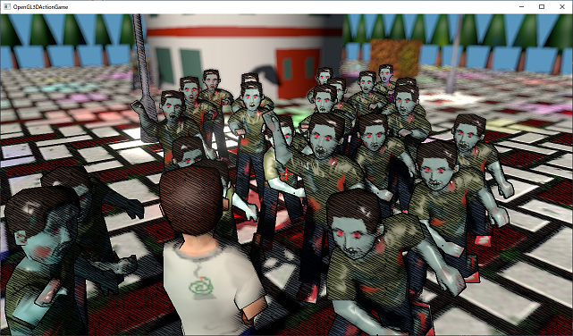
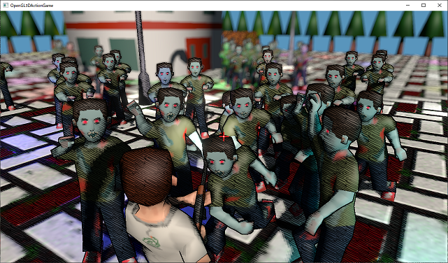
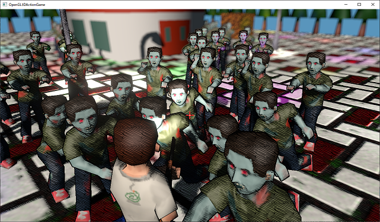
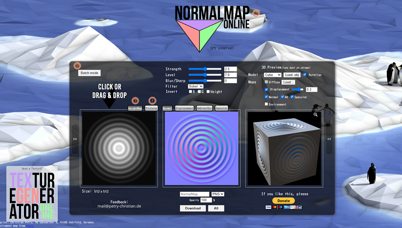

[OpenGL 3D 2021 Tips 第09回]

# 法線マッピング

## 1. 法線マッピングの実装

<p align="center">

</p>

### 1.1 法線マッピングのしくみ

布地の繊維、アスファルトの凹凸(おうとつ)、水面に立つさざなみなど、現実世界には微細な凹凸が数多く存在します。人間は、物体表面にこうした詳細情報があることに慣れているため、凹凸の感じられない物体は作り物だと感じてしまいます。

もちろん、3Dモデルに実際の凹凸を作り込むことができれば問題は解決します。しかし、微細な凹凸を再現するためには膨大な頂点数が必要なため、現実的ではありません。

3Dグラフィックス性能が十分ではなかった頃は、これらの凹凸はカラーテクスチャに直接描き込むことで再現していました。

しかし、カラーテクスチャに描き込まれた凹凸は、どこから見ても、またどのような光の当たり方をしても陰影を変化させることはありません。そのため、まやかしの陰影であるとすぐに気づかれてしまいます。

法線マッピングはこの問題を解決します。法線マッピングの基本的な考え方は「凹凸が陰影を生むのは法線方向が異なるからだ。つまり、法線さえ再現できれば実際に凹凸を作る必要はない」というものです。

法線の再現には、カラーのかわりに法線を記録したテクスチャを使います。法線を記録したテクスチャのことを「法線テクスチャ」といいます。

### 1.2 アクターに法線テクスチャを追加する

法線テクスチャに記録する法線には、モデル空間の法線か、ポリゴン平面を基準とする法線のいずれかが使われます。モデル空間を使う場合は「オブジェクトスペース法線マッピング」、ポリゴン平面を使う場合は「タンジェントスペース法線マッピング」と呼ばれます。

実装は「オブジェクトスペース法線マッピング」のほうが簡単なのですが、モデルの変形に対応することが難しいという欠点があります。そのため、今回は変形に対応している「タンジェントスペース法線マッピング」を使うことにします。

タンジェントスペース法線マッピングの実装手順は次のとおりです。

>1. `Actor`クラスに法線テクスチャ変数を追加。
>2. `Draw`関数内で法線テクスチャをバインド。
>3. フラグメントシェーダーに法線テクスチャのサンプラーを追加。
>4. テクスチャから法線を読み取る。
>5. 法線をポリゴン平面の空間(タンジェント空間)からワールド空間に変換。

それでは「アクターに法線テクスチャ変数を追加」するところからやっていきましょう。`Actor.h`を開き、`Actor`クラスに次のプログラムを追加してください。

```diff
   float morphTransitionTimer = 0;
   std::shared_ptr<Texture::Image2D> texture;
   std::shared_ptr<Texture::Image2D> texMetallicSmoothness;
+  std::shared_ptr<Texture::Image2D> texNormal;
 
   glm::vec3 position = glm::vec3(0); // アクターの表示位置.
   glm::vec3 rotation = glm::vec3(0); // アクターの向き.
```

次に法線テクスチャをグラフィックスパイプラインにバインドします。`Actor.cpp`を開き、`Draw`メンバ関数に次のプログラムを追加してください。

```diff
     texMetallicSmoothness->Bind(1);
   } else {
     glBindTextures(1, 1, nullptr);
   }
+  // 法線テクスチャをバインド.
+  if (texNormal) {
+    texNormal->Bind(2);
+  } else {
+    glBindTextures(2, 1, nullptr);
+  }

   // プリミティブを描画.
   primitive->Draw(morphTarget, prevBaseMesh, prevMorphTarget);
```

これでアクタークラスの準備は完了です。

### 1.3 フラグメントシェーダーで法線テクスチャを読み取る

ここからは、フラグメントシェーダーに法線マッピング機能を追加していきます。まずサンプラを追加しましょう。`FragmentLighting.frag`を開き、次のプログラムを追加してください。

```diff
 // ユニフォーム変数
 layout(binding=0) uniform sampler2D texColor;
 layout(binding=1) uniform sampler2D texMetallicSmoothness;
+layout(binding=2) uniform sampler2D texNormal;
 layout(binding=4) uniform sampler2D texShadow;

 // 平行光源
 struct DirectionalLight {
```

タンジェントスペースの法線の計算は結構手間がかかるので、単独の関数として作成することにします。`TileData`ブロックの定義の下に、次のプログラムを追加してください。

>以下の計算は`http://www.thetenthplanet.de/archives/1180`に基づいています。

```diff
   uint lightCounts[tileCount.y][tileCount.x];
   Light lights[maxLightCount];
 };
+
+/**
+* 法線を計算する.
+*
+* @param V ピクセルから視点へ向かうベクトル.
+*/
+vec3 computeNormal(vec3 V)
+{
+  vec3 N = normalize(inNormal);
+  vec3 normal = texture(texNormal, inTexcoord).rgb;
+
+  // 法線の長さが短すぎる場合、法線テクスチャが設定されていないとみなして頂点法線を返す.
+  if (dot(normal, normal) <= 0.0001) {
+    return N;
+  }
+}

 /**
 * フレネル反射率を計算する.
```

関数名は`computeNormal`(コンピュート・ノーマル)としました。コンピュートノーマル関数の引数は「ピクセルから視点へ向かうベクトル」です。これはビューベクトルの向きを逆にしたものになります。

関数の先頭では、頂点法線を正規化し、法線テクスチャを読み込みます。読み込んだ法線の値が`0`に近い場合、法線テクスチャが設定されていないと考えられます。この判定は、法線の長さが(誤差はあるにしても)`1`であることを利用しています。

法線テクスチャが設定されていないと判定された場合、正規化された頂点法線を返します。

### 1.4 法線テクスチャの値を-1～+1に戻す

法線テクスチャが設定されている場合は法線の計算を続けます。

3Dグラフィックスの法線はx,y,zの各軸が`-1`～`+1`の範囲を取ります。しかし、テクスチャは`0`～`1`の範囲を取ります。

この違いに対応するため、法線テクスチャには`-1`～`+1`を`0`～`1`に変換して記録し、シェーダーでは法線テクスチャから値を読み取ったあとで`-1`～`+1`に戻す処理を行います。

単純に考えると、「法線→テクスチャ値」の場合は`法線 * 0.5 + 0.5`という計算を行い、「テクスチャ値→法線」の場合は`テクスチャ値 * 2.0 - 1.0`という計算を行えばよいように見えます。

ただし、8bitデータが取りうる数値は`0`～`255`の256種類しかありません。例えば法線の`0`を上記の式でテクスチャ値に変換すると`0.5`になりますが、これは8bitでは`127.5`に当たります。

もちろん8bitデータには小数点以下の値を入れることはできません。そのため、一般的には「法線の`0`がテクスチャ値の`127`に当たる」ように変換します。

この場合、「法線→テクスチャ値」は`法線 * (127.0 / 255.0) + (127.0 / 255.0)`、「テクスチャ値→法線」は`テクスチャ値 * (255.0 / 127.0) - 1.0`という計算式になります。

なお、この8bit対応の計算式では、実際に使われるテクスチャ値の範囲は`0`～`254.0/255.0(=約0.996)`となります。

それではテクスチャの値を法線に戻しましょう。`computeNormal`関数に次のプログラムを追加してください。

```diff
   if (dot(normal, normal) <= 0.0001) {
     return N;
   }
+
+  // 8bit値であることを考慮しつつ0～1を-1～+1に変換(127を0とみなす)
+  normal = normal * (255.0 / 127.0) - 1.0;
 }

 /**
 * フレネル反射率を計算する.
```

>**【カラー以外を扱えるテクスチャフォーマットについて】**<br>
>最近のシステムでは`-1`～`+1`を記録できるテクスチャフォーマットが使えます。それらのフォーマットは、既存のフォーマットより効率的に法線を扱うことができます。
>法線をそのまま記録できるフォーマットを使う場合、この節で行った計算は不要です。

### 1.5 TBN行列を作成する

タンジェントスペース法線マッピングの場合、法線テクスチャには「ポリゴン平面を基準とした法線」を記録します。この方法では法線`(0, 0, 1)`をポリゴン平面(タンジェント空間)の法線とみなします。

空間の定義が異なるために、タンジェント空間の法線をそのままではワールド空間の法線として使うことはできません。そこで、タンジェント空間の法線をワールド空間の法線に変換します。

この変換は「TBN行列」と呼ばれる行列を使って行います。TBN(ティービーエヌ)は`Tangent`(タンジェント)、`Bi-normal`(バイノーマル)、`Normal`(ノーマル)の頭文字です。

このうち「ノーマル」は文字どおり頂点法線のことです。タンジェントは頂点法線とバイノーマルに直行する単位ベクトル、バイノーマルは頂点法線とタンジェントに直行する単位ベクトルです。

TBN行列を作成するには偏微分(へんびぶん)を計算する`dFdx`(ディーエフ・ディーエックス)、`dFdy`(ディーエフ・ディーワイ)関数を使います。

偏微分と聞くと難しそうですが、この関数が実際に行うことは

>ある値について、隣のピクセルで計算された値との差分を返す

というものです。

例えば、描画座標`gl_FragCoord.x`を`dFdx`関数の引数に与えた場合、戻り値は常に`1`です。現在処理中のピクセルの`gl_FragCoord.x`が`100`だとすると、隣のピクセルの`gl_FragCoord.x`は`101`に決まっているからです。

こんなことができるのは、`dFdx`と`dFdy`が「隣のピクセルで計算された値を知る能力」を持っている、ちょっと特殊な関数だからです。

`dFdx`と`dFdy`を使って何をするかというと、ワールド座標系のXZ軸およびテクスチャ座標系のUV軸を求めます。

これらの値を求める理由は、法線マッピングで使われるタンジェント空間は、テクスチャ座標のU,V軸をX,Y軸とし、テクスチャ平面に対して垂直なベクトルをZ軸としたものだからです。

まずビューベクトルの差分からXY軸を計算します。法線を`-1`～`+1`に戻すプログラムの下に、次のプログラムを追加してください。

>`perp`は`perpendicular`(パーペンディキュラー、垂直)の短縮形です。

```diff
   // 8bit値であることを考慮しつつ0～1を-1～+1に変換(127を0とみなす)
   normal = normal * (255.0 / 127.0) - 1.0;
+
+  // ビューベクトルの差分を取得.
+  vec3 dp1 = dFdx(-V);
+  vec3 dp2 = dFdy(-V);
+
+  // ビューベクトルの差分ベクトルと法線に対して垂直なベクトルを計算.
+  vec3 dp1perp = cross(N, dp1); // Yベクトル
+  vec3 dp2perp = cross(dp2, N); // Xベクトル
 }

 /**
 * フレネル反射率を計算する.
```

次にテクスチャ座標の差分を取得し、XYベクトルに射影します。これによってワールド座標系のタンジェントとバイノーマルが求まります。

```diff
   vec3 dp1perp = cross(N, dp1); // Yベクトル
   vec3 dp2perp = cross(dp2, N); // Xベクトル
+
+  // テクスチャ座標の差分(UV軸ベクトル)をXYベクトルに射影してTとBを計算.
+  vec2 duv1 = dFdx(inTexcoord);
+  vec2 duv2 = dFdy(inTexcoord);
+  vec3 T = dp2perp * duv1.x + dp1perp * duv2.x;
+  vec3 B = dp2perp * duv1.y + dp1perp * duv2.y;
 }

 /**
 * フレネル反射率を計算する.
```

さて、計算されたタンジェントとバイノーマルは正規化する必要があります。しかし、タンジェントとバイノーマルを個別に正規化すると、テクスチャのUVが正確に同じ比率で設定されていない場合に法線の方向がゆがむことがあります。

このゆがみを回避するには、タンジェントとバイノーマルの比率を維持しつつ正規化しなくてはなりません。比率を維持するために、タンジェントとバイノーマルのどちらか大きい方を基準に正規化を行います。

タンジェントとバイノーマルを求めるプログラムの下に、次のプログラムを追加してください。

```diff
   vec3 T = dp2perp * duv1.x + dp1perp * duv2.x;
   vec3 B = dp2perp * duv1.y + dp1perp * duv2.y;
+
+  // TとBを正規化.
+  float invmax = inversesqrt(max(dot(T, T), dot(B, B)));
+  mat3 TBN = mat3(T * invmax, B * invmax, N);
 }

 /**
 * フレネル反射率を計算する.
```

上記のプログラムにおいて、`invmax`(インブ・マックス)は「タンジェントとバイノーマルのうち、長いほうのベクトルの長さの逆数」が代入されます。

この式に出てくる`inversesqrt`(インバース・スクウェア・ルート)は「平方根の逆数」を計算する関数です。

ここで、この式がどのように出てきたのかを簡単に解説します。まずベクトルの長さは

`sqrt(v.x^2 + v.y^2.y + v.z^2)`

とすることで計算できます(ここで`sqrt`(スクウェア・ルート)は平方根を計算する関数です)。「ベクトルの各要素を2乗して足し合わせる」という操作は内積を使って行えるので、

`sqrt(dot(v, v))`

と変形できます。次に、ベクトルの正規化は「ベクトル÷ベクトルの長さ」で計算されます。すると、式は

`v / sqrt(dot(v, v))`

となります。この式を変形して

`v * (1 / sqrt(dot(v, v)))`

とします。この`1 / sqrt`の部分はまさに`inversesqrt`関数が行うことです。ですから、

`v * inversesqrt(dot(v, v))`

と変形できます。あとは`max`関数を使用して、タンジェントとバイノーマルのどちらか大きい方を選ぶだけです。

こうして求めた`invmax`(インブ・マックス)をタンジェントとバイノーマルの両方に掛けて、2つのベクトルを正規化します(正確にはどちらか一方だけが完全に正規化され、他方は不完全な正規化になります)。

これでTBN行列を求めることができました。仕上げにTBN行列を使ってテクスチャから読み取った法線をワールド座標系に変換します。TBN行列を求めるプログラムの下に次のプログラムを追加してください。

```diff
   float invmax = inversesqrt(max(dot(T, T), dot(B, B)));
   mat3 TBN = mat3(T * invmax, B * invmax, N);
+
+  return normalize(TBN * normal);
+}

 /**
 * フレネル反射率を計算する.
```

これで法線をワールド座標系に変換する関数は完成です。

### 1.6 法線を計算する

仕上げに、ワールド座標系の法線の計算を`coumputeNormal`関数で置き換えます。`worldNormal`変数を定義するプログラムを次のように変更してください。

```diff
   float z = inShadowPosition.z / inShadowPosition.w;
   float shadow = float(textureProj(texShadow, inShadowPosition.xyw).r > z);

   vec3 viewVector = normalize(viewPosition - inPosition); // 視線ベクトル
-  vec3 worldNormal = normalize(inNormal);
+  vec3 worldNormal = computeNormal(inNormal);
   vec3 totalLightColor = ambientLight;
   vec3 totalSpecularColor = vec3(0); // 全てのライトの鏡面反射の合計
```

これでタンジェントスペース法線マッピングの準備が整いました。

### 1.7 法線テクスチャを指定する

それでは法線テクスチャを使ってみましょう。以下のULRから`zombie_male_normal.tga`というファイルをダウンロードして、プロジェクトの`Res`フォルダに保存してください。

>`https://github.com/tn-mai/OpenGL3D2020/tree/master/Res/zombie_male`

次に`ZombieActor.cpp`を開き、コンストラクタの定義に法線テクスチャを設定するプログラムを追加してください。

```diff
   Actor("zombie", nullptr,
     Texture::CreateImage2D("Res/zombie_male.tga", Texture::ImageType::color),
     pos)
 {
+  // テクスチャを設定.
+  texNormal = Texture::CreateImage2D("Res/zombie_male_normal.tga", Texture::ImageType::non_color),
+
   // 重力の影響率を設定.
   gravityScale = 1;
```

プログラムが書けたらビルドして実行してください。ゾンビの質感が多少リアルになっていたら成功です。

<p align="center">
<br>
[デフォルト状態]
</p>

<p align="center">
<br>
[法線テクスチャ]
</p>

<p align="center">
<br>
[法線テクスチャ+メタリックラフネステクスチャ]
</p>

<pre class="tnmai_assignment">
<strong>【課題01】</strong>
<code>DeathEffect.frag</code>に法線マッピング機能を追加しなさい。
</pre>

<div style="page-break-after: always"></div>

## 2. 法線テクスチャの作りかた

### 2.1 オンラインで法線テクスチャを作成する

通常、法線テクスチャはMayaやBlenderなどの3Dモデリングツールで作成します。しかし、簡単な法線マップなら以下のサイトなどで生成可能です。

>`https://cpetry.github.io/NormalMap-Online/`

<p align="center">

</p>

>**【使い方】**
>
>1. 法線テクスチャの元になるカラー画像を用意する。画像形式は`PNG`、`JPG`、`BMP`<br>にすること。`TGA`は使えないので注意。`TGA`形式の画像しかない場合は、<br>`Visual Studio`などで`PNG`形式のコピーを作っておくこと。
>2. ブラウザでNormalMap-Onlineのページを開き、左側の画像の部分に用意したカラー画像をドラッグ&ドロップする。
>3. 中央に法線テクスチャが作成される。濃い緑色や濃い紫色の部分がある場合、凹凸が強調されすぎている。上部の`Strength`(ストレングス)バーを操作して、濃い緑や紫が目立たないように調整する。
>4. 中央下部にある`download`(ダウンロード)ボタンをクリックして、作成した法線テクスチャをダウンロードする。

<div style="page-break-after: always"></div>

<pre class="tnmai_assignment">
<strong>【課題02】</strong>
Normal Map Onlineを利用して地面の法線テクスチャを作成し、地面モデルに適用しなさい。Normal Map OnlineはTGAファイルに対応していないので、<code>Ground.tga</code>をPNGファイルに変換する必要があるでしょう。
なお、画像の状態によりますが、テキストのとおりに作成した地面画像の場合、ドラッグ&ドロップした時点ではストレングスが強すぎます(明るさの差が大きいため)。
ストレングスを<code>0.1</code>程度にするとちょうど良くなるでしょう。基本的には、濃い緑や紫の部分がなくなるように調整してください。
</pre>
